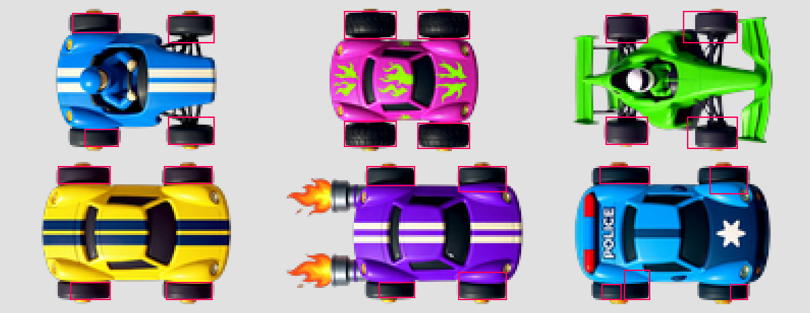

# Vicky Racer — Plan: animated cars

Status: **proposal, not built.** A plan for making the cars feel alive while they drive, starting
with wheels that visibly roll. Nothing here changes handling; it is all drawing.

## 1. What we have today

**The art.** Every car is one flat PNG, 128 × 72 px, seen from straight above, facing +X:
12 originals in `art/cars/setups/<car>.png` and 60 recolours in
`art/cars/paint/<car>_<colour>.png` (12 cars × blue, green, pink, purple, yellow), plus the four
old `art/cars/car_<colour>.png`. The wheels are **baked into the body**: four dark tyres poking out
above and below the body, front pair on the right. The rocket's exhaust flames are baked in too.

Two facts about the art decide the approach:

- **The wheels are seen from above.** A top-down tyre does not visibly turn round its axle the way
  a side-view wheel does. What reads as "rolling" from above is the **tread sliding past**, plus
  the **front wheels turning** when steering. Rotating a wheel sprite round its centre would look
  like steering, not rolling.
- **The recolours are not pixel-identical.** The paints are Kontext edits of the original, and
  their silhouettes differ by a few pixels (alpha masks of `kart_blue` vs `kart_pink` differ inside
  a box of about 80 × 70 px). So wheel positions must be found **per image** — 76 images, not 12.

**The rendering.** All drivable cars are `actors/car/car.tscn`: a `CharacterBody2D` (`car.gd`)
with one `Sprite2D` child named `Body`, whose texture comes from `Car.body_texture`, set from the
setup (`DriftSetup.body`) or from `Paint.body(setup, colour)`. That one scene is used by the race
(`game/managers/racer_spawner.gd`), the town and its traffic (`game/screens/town.gd`), the title
screen (`ui/title/title_screen.gd`) and the tests. Ghosts are separate: `actors/ghost/ghost_car.gd`
is a plain `Sprite2D` replaying a recorded lap. The garage, podium and standings show static
pictures and need no animation. Effects (`car_effects.gd`) already generate their textures in code
and already flash `Body.self_modulate` for the car wash; skid marks and tyre smoke use a hard-coded
rear axle at `Vector2(-40, 0)`.

## 2. The options

| Approach | How it works | Art cost | Verdict |
| --- | --- | --- | --- |
| **A. Frame animation** | 3–4 frames per car with the tread shifted, swapped by speed (`AnimatedSprite2D` or an atlas) | 76 × 4 = 304 images; Kontext/FLUX will not keep frames consistent, so they would flicker | **No.** Too much generated art for the effect, and a nightmare to keep in sync with paints. |
| **B. Separate wheel sprites** | Cut the tyres out of each body, draw them as child `Sprite2D`s; rotate the front pair for steering, scroll/swap them for rolling | A tool pass over all 76 bodies (erase the tyres, export wheel PNGs) plus a small hand fix per car | **Later, for steering only.** It is the only way to turn the front wheels convincingly, but it touches every body image. |
| **C. Shader on the baked wheels** | A `canvas_item` shader on `Body` draws moving tread lines over the tyre pixels, inside four wheel rectangles per texture; the car feeds it how far it has rolled | No new art. One generated data file of wheel rectangles, checked once by eye | **Yes — do this first.** Cheap, works with every existing paint, and new cars only need their rectangles. |
| **D. Node rotation / transforms** | Rotate, squash or tilt the `Body` sprite itself | None | **Yes, as extras** (lean and bounce, §5) — not for wheels. |

**Recommendation: C now, B only if steering front wheels turn out to be wanted, D as small
extras.** The plan below is phased so each phase ships on its own.

## 3. Phase 20a — Rolling tread (shader)

### 3.1 Wheel rectangles

A new tool, `tools/comfy/wheel_rects.py`, finds the four tyres in every car body and writes
`art/cars/wheels.json`:

```json
{
  "res://art/cars/paint/kart_blue.png": {
    "front_left":  [79, 2, 102, 16],
    "front_right": [79, 57, 102, 71],
    "rear_left":   [32, 2, 55, 16],
    "rear_right":  [38, 57, 55, 71]
  }
}
```

Rectangles are `[x0, y0, x1, y1]` in texture pixels; "left" is the top of the image (the car's
left when it faces +X).

Detection: tyre pixels are opaque, dark (luma < 70) and grey (low saturation); look for runs of
such columns in the top and bottom 18 px bands, two per band. A first naive pass already finds most
tyres, but not all of them — e.g. the kart's rear-right tyre is only half found and the police
car's lower tyres are split by its orange hubcaps:



So the tool must (1) merge runs separated by a few px of hub colour, (2) pair each paint with its
original and warn when a rectangle moved more than ~3 px, (3) accept hand overrides from a small
`overrides` section in `tools/comfy/asset_manifest.json`, and (4) write a contact sheet with the
rectangles drawn on, like `postprocess.py` already does for other assets, to check all 76 at a
glance. `generate_assets.py` calls it after it builds paints, so new cars and colours get their
rectangles automatically.

The tyre **mask** inside a rectangle is computed in the shader from the same dark-and-grey rule,
so hubcaps, suspension arms and body paint overlapping the rectangle are left alone.

### 3.2 The shader

`actors/car/car_body.gdshader`, a `canvas_item` shader:

- uniforms `vec4 wheels[4]` (rectangles in UV), `float roll_front`, `float roll_rear` (distance
  rolled, px), `float blur` (0..1);
- inside a wheel rectangle and on a tyre-coloured pixel, darken stripes across the tyre:
  `step(fract((x + roll) / TREAD_PERIOD), TREAD_WIDTH)`, with a period of about 4 px of texture
  (≈ 3 tread bars visible on a tyre), stripes perpendicular to the car's heading;
- `blur` fades the stripes' contrast towards a flat even darkening at speed, so fast wheels look
  smeared instead of strobing backwards (wagon-wheel effect);
- everywhere else the texture is drawn untouched, so `modulate` / `self_modulate` (wash shine,
  ghost tint) keep working.

### 3.3 Driving it

A small new script, `actors/car/car_wheels.gd`, on a `Wheels` node in `car.tscn` (keeping
`car.gd` about handling only, as its header says):

- looks up `wheels.json` for `car.body_texture.resource_path` whenever the texture changes (paint
  change, title screen, town). No entry → no material: the car just looks as it does today;
- gives `Body` its own `ShaderMaterial` per car (`duplicate()`; the rectangles differ per paint);
- each physics tick: `roll += car.forward_speed() * delta` — signed, so reversing rolls backwards;
  rear wheels stop (`roll_rear` frozen) while `car.handbrake` is held, which looks like locked
  wheels in a handbrake drift; frozen cars (countdown) do not roll;
- `blur = smoothstep(BLUR_FROM, BLUR_TO, abs(speed))`, both constants in px/s, tuned by eye.

`ghost_car.gd` gets the same material and computes its roll from the distance between recorded
samples, so ghosts roll too.

### 3.4 Files

| File | Change |
| --- | --- |
| `tools/comfy/wheel_rects.py` | new: detect, merge, override, contact sheet, write JSON |
| `tools/comfy/generate_assets.py` | run `wheel_rects.py` after paints |
| `tools/comfy/asset_manifest.json` | `wheel_overrides` section for hand fixes |
| `art/cars/wheels.json` | new, generated |
| `actors/car/car_body.gdshader` | new |
| `actors/car/car_wheels.gd` + `car.tscn` | new node feeding the shader |
| `actors/ghost/ghost_car.gd` | material + roll from samples |
| `tests/effects_test.gd` | roll advances with speed, goes backwards in reverse, rear stops on handbrake, none while frozen |
| `tests/` (new check, or in `front_end_test.gd`) | every body texture reachable through `Paint.body` has four wheel rectangles |
| `docs/DESIGN.md` §4 effects table | one row: rolling wheels |

### 3.5 Steps

1. Write `wheel_rects.py`, run it on all 76 bodies, fix misses with overrides until the contact
   sheet is right.
2. Write the shader; try it on one car in `game/screens/test_drive.tscn` and tune period, width,
   darkness and blur.
3. Add `car_wheels.gd`, hook it into `car.tscn`, check race, town (24 traffic cars), title screen,
   split screen.
4. Ghost cars.
5. Tests, then `tests/perf_probe.gd` on a full race to confirm no frame-time cost (one extra
   texture sample per pixel of 8–24 small sprites — expected negligible).
6. DESIGN.md row and a short ROADMAP entry.

## 4. Phase 20b — Steering front wheels (optional)

Only if 20a is not enough. Reuses the rectangles from 20a:

1. `wheel_rects.py --cut` erases the two **front** tyres' pixels (the tyre mask only) from every
   body and writes one front-wheel PNG per car (from the original; tyres are black, so the paints
   can share it — check this on the contact sheet).
2. `car.tscn` gets two `Sprite2D` front wheels drawn behind `Body` (`show_behind_parent`), placed
   at the rectangle centres from `wheels.json`.
3. `car_wheels.gd` rotates them by `steer_input × MAX_WHEEL_ANGLE` (~25°), smoothed; the tread
   shader runs on the wheel sprites instead of the body for the front pair.

Risk: the erased body may show a hole where a tyre overlapped the body outline; that needs a hand
touch-up per car (12 originals × 6 paints). That cost is why this is a separate, optional phase.

## 5. Extras that fall out of the same work (optional, small)

- **Body lean** — tilt `Body` a couple of degrees against the sideways speed while drifting, and
  a tiny squash when hitting a wall (`CAR_wall_hit`). Pure transforms, in `car_wheels.gd` or
  `car_effects.gd`.
- **Idle shake** — a sub-pixel engine wobble at standstill during the countdown.
- **Rocket flames** — the rocket's baked flames could flicker with the same shader (a flame mask
  rectangle instead of wheels) and grow with throttle/boost.
- **Exact skid marks** — `skid_marks.gd` and `car_effects.gd` could use the real rear-wheel
  positions from `wheels.json` instead of the fixed `Vector2(-40, 0)`.

## 6. Done when

- Every car in every paint shows tread rolling at its speed, backwards in reverse, locked rear
  wheels on the handbrake, a smooth blur at top speed, in races, town, title screen and ghosts.
- No car without wheel data looks any different from today.
- Tests pass headless; the perf probe shows no measurable frame-time change.
