# Vicky Racer — Design Document

A 2D top-down arcade racer for a young child, built in **Godot 4.7** (Forward+ renderer). The
player races three AI cars around tile-built circuits, earns coins by finishing, and spends them in
a garage on drift setups that change how the car handles. All art is generated locally with
ComfyUI from a single frozen recipe.

This document was written ahead of the code, with every system marked **(not implemented)** until
it landed. All of v1 is now built — the last markers came off with Phase 8 (effects, sound and the
balance pass) — and the document describes the game as it is. Mockups referenced here live in
[`mockups/`](mockups/); every generated image there is reproducible from
[`mockups/seeds.json`](mockups/seeds.json).

---

## 1. Design pillars

| Pillar | What it means in this build |
| --- | --- |
| **Forgiving by construction** | The car *cannot* spin out — steering rotates the car directly instead of applying torque. Walls slide you along rather than stopping you. Grass slows you but never ends your race. Nobody is ever told they lost. |
| **Drift is the fun** | Handling splits forward and sideways grip, so the car slides through corners and the handbrake kicks the tail out on demand. The garage is a menu of different answers to "how slidey?". |
| **Readable at a glance** | Bars instead of numbers, big position and lap readouts, a world-up camera that never rotates, four racers in four primary colours. A child who cannot read yet can still play. |
| **One good track before many** | A single hand-designed circuit, tuned until it is fun, before any second track is considered. |

## 2. Core loop

```
   ┌────────────────────────────────────────────────────────────────┐
   │                                                                │
   ▼                                                                │
 GARAGE ──► GRID ──► 3·2·1·GO ──► RACE 3 LAPS ──► RESULTS ──► COINS ─┘
 (buy /     (4 cars,  (cars       (drift, pass,    (order,     (paid by
  equip      player    frozen)     minimap,         best lap)   position,
  a drift    last-but-                position)                  generous
  setup)     one)                                                floor)
```

0. **Title.** The logo and PLAY / SETTINGS / QUIT over a live race of four AI cars.
1. **Garage.** Browse six drift-setup cards with a gamepad or keyboard. Buy what you can afford,
   equip what you own, press **RACE!**.
2. **Grid.** Four cars on a staggered two-wide grid behind the start/finish line.
3. **Countdown.** A big 3 · 2 · 1 · GO! Cars are frozen until GO.
4. **Race.** Three laps. A lap only counts if the mid-lap checkpoint was crossed.
5. **Results.** Always celebratory. The finishing order slides in, then the coin payout counts up.
6. **Back to the garage** — or straight into **RACE AGAIN**, focused by default.

## 3. Controls

| Action | Keyboard | Gamepad |
| --- | --- | --- |
| Steer | ← → or A D | Left stick X (analog) |
| Accelerate | ↑ or W | RT or A |
| Brake / reverse | ↓ or S | LT or B |
| Handbrake (drift) | Space | X |
| Confirm (menus) | Enter | A |
| Back (menus) | Esc | B |
| Race from garage | R | Y |
| Pause (race) | Esc | Start |
| Horn (race) | H | Y |
| Paint the focused car (garage) | C | X |
| Turn the garage page | Q / E | LB / RB |

Escape and B also go back from the garage to the title. In a race, Escape pauses instead of
leaving: one wrong button must never throw away a race (§10).

Both keyboard layouts are always live, so two hands can find the controls without being taught.
Steering reads `Input.get_axis`, which gives analog steering on a stick for free. Menu glyphs swap
between keyboard and gamepad depending on which was used last.

### 3.1 Assists

Two switches on the settings screen, both off by default, both applied live by
[`player_input.gd`](../actors/car/player_input.gd):

- **AUTO GO** — the car cruises at 65 % of its top speed with no pedal held, so a very young child
  only has to steer. Holding accelerate still gives full speed, and braking still brakes.
- **STEER HELP** — steers toward the road ahead: fully while the child is not steering, as a gentle
  nudge (30 %) on top of their steering when they are. It keeps whatever lane the child is in and
  only pulls toward the middle near the edge of the road.

Both on with no input at all, the car laps Track 01 without leaving the road or touching a wall,
and finishes **3rd** — the assists help, they do not race. At 80 % cruise it won outright, which
made it an autopilot; 65 % was chosen so that pressing the pedal still pays
([`tests/assist_test.gd`](../tests/assist_test.gd)).

## 4. Handling model

The car is a `CharacterBody2D` that points **+X**. Every physics frame:

```
forward = Vector2.RIGHT.rotated(rotation)
speed   = velocity.length()

# Steering is input-driven ROTATION, scaled by SIGNED forward speed.
# Because rotation comes from input and not from torque, the car cannot spin out;
# signed speed makes reversing steer the natural way round.
rotation += steer * max_steer_rate * clamp(forward_speed / steer_speed_ref, -1, 1) * delta

# Throttle acts along forward only. Braking below 40 px/s becomes reverse,
# at reverse_power_fraction of engine power, capped at max_reverse_speed.
velocity += forward * accel * delta

# Drift: split velocity and damp each part with its own coefficient.
# exp() is the exact form of per-frame damping and can never overshoot.
fwd_v = forward * velocity.dot(forward)
lat_v = velocity - fwd_v
grip  = (handbrake_lateral_grip if handbrake else lateral_grip) * surface.grip_mult
velocity = fwd_v * exp(-forward_drag * delta) + lat_v * exp(-grip * delta)

# Over the speed limit (e.g. just left the road) the car slows at 1500 px/s², not instantly.
move_and_slide()   # on a fresh wall hit: velocity *= (1 - wall_speed_scrub), keep the slide
```

Implemented in [`actors/car/car.gd`](../actors/car/car.gd). The promises above are checked by
[`tests/handling_test.gd`](../tests/handling_test.gd) — it cannot spin out (even on Banana with
the handbrake), cannot turn on the spot, the handbrake at least doubles the slide, walls slide you
along, grass slows you gradually, and every setup resolves within the clamps:

```bash
Godot_v4.7.1-stable_win64_console.exe --path . --headless --fixed-fps 60 res://tests/handling_test.tscn
```

- **High `lateral_grip`** — the car goes where it points. **Low** — it keeps travelling sideways
  after it turns, which is the drift.
- The **handbrake** swaps in a much lower grip to kick the tail out on demand.
- **Speed-scaled steering** stops the car pirouetting on the spot and keeps it calm at speed.
- `CAR_drift_started` / `CAR_drift_ended` fire when `lat_v.length()` crosses a threshold; skid
  marks and the drift sound hang off those signals (§4.3).

### 4.1 `CarConfig` — the base car

One `Resource` holds the base values, editable in the inspector while the game runs. Starting point:

| Field | Value | Unit |
| --- | --- | --- |
| `engine_power` | 1400 | px/s² |
| `brake_power` | 2200 | px/s² |
| `max_speed` | 1100 | px/s |
| `max_steer_rate` | 3.2 | rad/s |
| `steer_speed_ref` | 350 | px/s — full steering authority from this speed up |
| `forward_drag` | 0.6 | 1/s |
| `lateral_grip` | 9.0 | 1/s |
| `handbrake_lateral_grip` | 1.8 | 1/s |
| `wall_speed_scrub` | 0.15 | fraction of speed lost per wall hit |

### 4.2 `DriftSetup` — what the garage sells

A `DriftSetup` is a `Resource` of **multipliers over** `CarConfig`, never replacement values. Because
they multiply a sane base and the results are clamped, no setup can produce nonsense physics, and
none is a strict upgrade — each is a different trade.

Thirteen cars, in garage order (prices rise left to right, pages of six):

| Car | Grip × | Handbrake grip × | Engine × | Top speed × | Steer × | Off road × | Bars G / S / S | Price | Extras |
| --- | --- | --- | --- | --- | --- | --- | --- | --- | --- |
| **Starter** | 1.0 | 1.0 | 1.0 | 1.0 | 1.0 | 1.0 | 0.7 / 0.4 / 0.5 | owned | |
| **Grippy** | 1.5 | 1.6 | 0.95 | 0.95 | 1.05 | 1.0 | 0.95 / 0.15 / 0.45 | 100 | |
| **Soapbox** | 1.15 | 1.1 | 1.05 | 0.85 | 1.25 | 1.2 | 0.75 / 0.35 / 0.3 | 150 | open seat, like the kart; rattling wooden wheels instead of an engine, bicycle-bell horn |
| **Ice-Cream Van** | 1.1 | 1.0 | 0.85 | 0.88 | 0.95 | 1.0 | 0.75 / 0.3 / 0.3 | 200 | horn plays a jingle |
| **Slider** | 0.55 | 0.6 | 1.0 | 1.0 | 1.15 | 1.0 | 0.3 / 0.9 / 0.5 | 250 | |
| **Rocket** | 0.9 | 1.0 | 1.25 | 1.2 | 0.8 | 1.0 | 0.55 / 0.45 / 0.9 | 250 | |
| **Kart** | 1.2 | 1.0 | 1.1 | 0.85 | 1.35 | 1.0 | 0.8 / 0.35 / 0.35 | 250 | |
| **Monster Truck** | 1.4 | 1.3 | 0.9 | 0.9 | 0.9 | **0.2** | 0.9 / 0.2 / 0.4 | 300 | deep engine, air horn; grass barely slows it |
| **Bubble Car** | 0.6 | 0.7 | 1.15 | 0.92 | 1.4 | 1.0 | 0.35 / 0.85 / 0.4 | 300 | high-pitched engine |
| **Police Car** | 1.05 | 0.8 | 1.1 | 1.08 | 1.05 | 1.0 | 0.7 / 0.5 / 0.65 | 350 | siren lights flash while drifting, siren horn |
| **Banana** | 0.45 | 0.5 | 1.3 | 1.25 | 1.0 | 1.0 | 0.2 / 1.0 / 1.0 | 600 | |
| **Formula** | 1.0 | 0.9 | 1.2 | 1.2 | 0.95 | **1.5** | 0.6 / 0.4 / 1.0 | 700 | fastest on straights; must brake, hates grass |
| **Dragon** | 0.55 | 0.6 | 1.2 | 1.2 | 1.1 | 1.0 | 0.3 / 0.9 / 0.95 | 1000 | fire-coloured skid marks and smoke, roar horn |

Resolved values are clamped — `lateral_grip` never below 3.0, `max_speed` never above 1500 px/s,
and however bad a car is off road, grass and sand keep at least 25 % of its speed and grip — so
even Banana stays drivable and the Formula never gets stuck.

**Off road** (`offroad_mult`) scales how much grass and sand slow the car and loosen its grip: the
Monster Truck keeps ~90 % of its speed on grass where the Starter keeps 55 %, the Formula ~43 %.
Each car also brings its own **skid and smoke colour, engine pitch and horn** (`DriftSetup`'s
"Look and sound" group); H / gamepad Y sounds the horn in a race — pure fun, no effect.

The Phase 10 cars are Kontext edits of the Starter car, like the Phase 5 setups, so they share
one silhouette scale and the frozen look; candidates and picks are in
[`mockups/candidates/`](mockups/candidates/) (`card_monster.png` … `card_dragon.png`). Two needed a
second prompt: the first Monster Truck was red with knobbly tyres, too close to Grippy (now purple
with green flames), and the first Bubble Car came out in perspective (now a round car with a
central dome). The **Soapbox** (added 2026-10-07) is the exception: Kontext edits never matched the
matte clay look (real wood came out photographic, restyles came out glossy plastic), so it is an original
sprite in the house recipe, like `car_red`, with its seat left empty for the driver.

**A setup also changes how the car looks:** in the race the player drives the car from its garage
card — knobbly tyres for Grippy, light-blue swirls for Slider, boosters for Rocket, the go-kart, the
banana car ([`screenshots/setup_cars.png`](screenshots/setup_cars.png)). Setups were first
handling-only, which left a child who bought Banana still driving the plain red car. Because the
player's car can now share a colour with an opponent (Banana and Yellow), a small white arrow
always floats above the player's car. The three **bar values** are authored, not computed: they describe how
the setup *feels*, which is what the garage needs to communicate.

### 4.3 Feedback: marks, puffs, shake and sound

Drift is the fun, so a drift has to be *seen and heard* — the payoff for buying a slippery setup.

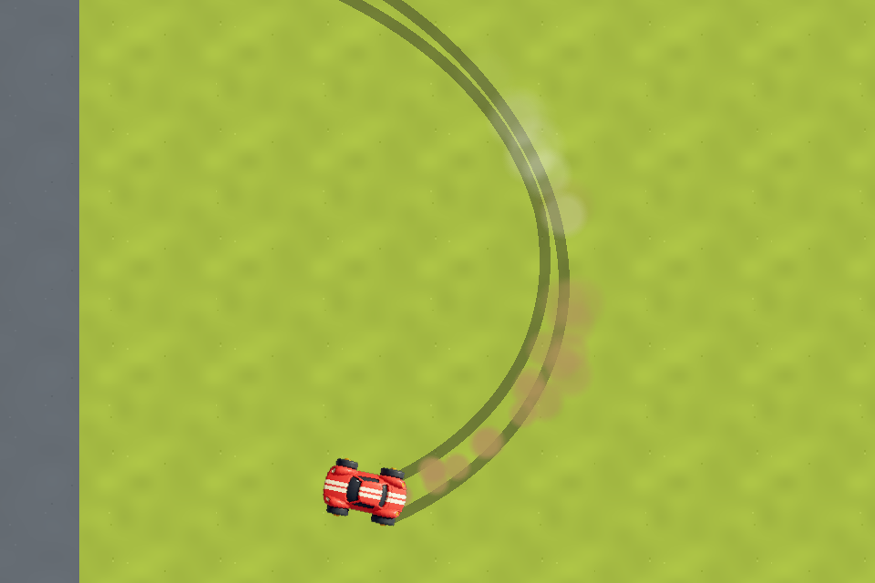

| Effect | Trigger | Built in |
| --- | --- | --- |
| **Skid marks** — two dark lines from the rear wheels, fading out 6 s after the drift, at most 80 kept | `CAR_drift_started` / `_ended`, any car | [`actors/effects/skid_marks.gd`](../actors/effects/skid_marks.gd), one node per race between the track and the cars, so marks lie under every car |
| **Tyre smoke** — white puffs while drifting on the road | the car's drift state | [`actors/car/car_effects.gd`](../actors/car/car_effects.gd) |
| **Dust** — earth-coloured on grass (green would vanish against it), sand-coloured on sand | `CAR_surface_changed` | same; the puff texture is a generated soft disc, no art file |
| **Rolling wheels** — tread slides over the tyres drawn into each body: backwards in reverse, rear pair locked on the handbrake, smeared flat at top speed; ghosts roll too, the Bubble Car (tyres hardly show) does not | every physics tick, from the car's forward speed | [`actors/car/rolling_tread.gd`](../actors/car/rolling_tread.gd) and its shader; tyre rectangles per body in [`game/configs/car_wheels.gd`](../game/configs/car_wheels.gd), generated by [`tools/comfy/wheel_rects.py`](../tools/comfy/wheel_rects.py) ([plan](CAR_ANIMATION_PLAN.md)) |
| **Wall shake** — the view jolts by up to 9 px and settles within a second; a bump to feel, not a jolt to frighten | `CAR_wall_hit` for the camera's own car | [`actors/car/chase_camera.gd`](../actors/car/chase_camera.gd), added to the rig's position so physics interpolation still smooths it |
| **Engine** — one steady loop, pitch from 0.6× at rest to 1.5× at top speed, a touch higher under throttle | every frame | [`actors/car/car_audio.gd`](../actors/car/car_audio.gd), positional: opponents are heard near the camera and fade with distance |
| **Tyre squeal** — a loop that fades in with sideways speed | the car's drift state | same |
| **Bump** — a soft thump, louder for harder hits | `CAR_wall_hit` | same |
| **Beeps** — three low beeps and a high GO | `RAC_countdown_tick` | [`game/managers/sound_manager.gd`](../game/managers/sound_manager.gd), in the main shell |
| **Fanfare**, **coin chime**, **menu click** | `RAC_race_finished`; `PRO_setup_purchased` and the results count-up; menu focus moving | same, and [`ui/results/results_screen.gd`](../ui/results/results_screen.gd) |

[`tests/effects_test.gd`](../tests/effects_test.gd) checks the visual effects headlessly. Sounds
are skipped under the dummy audio driver of headless runs: it never mixes, so a played sound would
never finish and be reported as leaked at exit. Where the sounds come from: §11.2.

## 5. Scale

| Thing | Size | Why |
| --- | --- | --- |
| Tile | 128 px | Large enough that generated textures keep their character; a 48 × 28 map stays manageable in the editor |
| Road | 3 tiles (384 px) | Room for two cars side by side plus a mistake |
| Car sprite | 128 × 72 px, facing +X | Godot 2D's zero rotation; reads clearly against a 384 px road |
| Car collision | 110 × 60 px rectangle | Slightly inside the sprite so contact looks fair |
| Viewport | 1920 × 1080, `canvas_items` / `expand` | Already set in `project.godot` |
| Camera zoom | 0.92, fixed | About 16 × 9 tiles visible. Close enough to match the chosen style frame, where cars read at ~130–160 px; the camera's 260 px lead toward the direction of travel shows about a second of road ahead at top speed. A speed-dependent zoom-out was dropped: changing zoom while driving defeats physics interpolation and made the view judder (see below) |

### 5.1 Smooth motion on fast monitors

Physics runs at 60 Hz, but monitors refresh at 100–165 Hz. Without help the car and camera only
move on physics ticks, so on a 100 Hz screen the view moves on three frames in five and stands
still on the other two — a judder that reads as flicker. The fix is Godot's **physics
interpolation** (`project.godot`), which draws everything between ticks. It only smooths node
*positions*, so the chase camera ([`actors/car/chase_camera.gd`](../actors/car/chase_camera.gd))
is built from positions alone: a rig node holds the lead, the Camera2D has no smoothing, and the
zoom is fixed. Anything teleported (a reset, the start grid) calls
`reset_physics_interpolation()` so it does not glide.

[`tools/dev/motion_check.py`](../tools/dev/motion_check.py) measures this on rendered frames
(100 fps against 60 Hz physics, tracking a hay bale): frame-to-frame wobble of the view went from
**17.8 px** without interpolation to **0.57 px** with it — the same as running physics at 100 Hz.

### 5.2 Performance

[`tests/perf_probe.gd`](../tests/perf_probe.gd) measures a full race with every car on
autopilot. Headless at a fixed 60 fps (`-- --autopilot --bench`), wall time per frame is the
whole CPU cost of simulating the race; with a window it reports frame rate, draw calls and
objects.

| Measure (RTX 5070 Ti machine) | Before the pass | After |
| --- | --- | --- |
| CPU per simulated frame (scripts + physics) | 415 µs | **234 µs** — 1.4 % of a 60 Hz frame |
| Windowed, vsync off | 1,940 fps | 2,190 fps |
| Draw calls / objects | ~40 / stable | unchanged |
| Race load (track, road, cars) | — | 18 ms |

Three changes, each measured on its own:

1. **Racing line baked at 20 px**, not Godot's default 5. Every closest-point search walks
   every baked point; a quarter of the points made each search ~11 → 3 µs. On Track 01's
   tightest bend the chord error is under a quarter pixel, and the balance table did not move.
2. **Each car measured once per frame.** The track (physics priority −2, before anyone
   else) searches the line once per car and caches progress and distance; the race, the AI and
   steering help read `Track.progress_of()` / `distance_of()` instead of searching again.
3. **Minimap line cached in map space**, rebuilt only on resize. Converting all 200 points every
   frame was the most expensive script in the race (71 µs).

The game is far inside its budget even on this fast machine; the margins are for the slower
laptop a child is likely to play on.

## 6. Architecture

### 6.1 Event bus

As in Vicky's Game, systems never hold references to each other. `game/event_system.gd` is the
single autoload (`EventSystem`) and declares every cross-system signal. Managers `connect` in
`_enter_tree()`; emitters call `EventSystem.<SIGNAL>.emit(...)`.

| Prefix | Domain | Signals |
| --- | --- | --- |
| `RAC_` | Race | `countdown_tick(n)`, `race_started()`, `lap_completed(racer, lap, lap_time)`, `final_lap_started()`, `positions_updated(order)`, `race_finished(results, track_id)`, `time_trial_finished(track_id, setup_id, lap_times, ghost)` |
| `CAR_` | Car | `drift_started(car)`, `drift_ended(car, duration)`, `surface_changed(car, surface)`, `wall_hit(car, impact_speed)` |
| `PRO_` | Progression | `state_requested()`, `state_changed(state)`, `buy_requested(id)`, `equip_requested(id)`, `coins_changed(total)`, `coins_awarded(amount, breakdown)`, `setup_purchased(id)`, `setup_equipped(id)`, `purchase_refused(id, reason)`, `sticker_earned(id)` |
| `CUP_` | Cups | `state_requested()`, `state_changed(state)`, `start_requested(id)`, `continue_requested()`, `progress_changed(progress)`, `finished(id, standings, trophy)` |
| `PLY_` | Players | `state_requested()`, `state_changed(state)`, `two_player_requested()`, `join_requested(device, setup_id)`, `car_requested(index, setup_id)`, `opponents_requested(on)` |
| `UI_` | Screens | `show_message(text, duration)`, `screen_requested(name)`, `settings_requested()`, `settings_changed(settings)`, `setting_change_requested(key, value)`, `music_requested(piece)` |

Screens never reach into managers. Following Vicky's Game's inventory pattern, a screen emits
`PRO_state_requested` and `GarageManager` answers synchronously with `PRO_state_changed`, carrying
the whole garage state: coins, owned and equipped setups, best laps and the last race. Buying and
equipping are requests (`PRO_buy_requested`, `PRO_equip_requested`); the manager decides.

Each `RAC_race_finished` result is a Dictionary: `name`, `body` (car sprite path), `is_player`,
`position`, `time`, `best_lap`.

### 6.2 Scenes and managers

```
main.tscn  (persistent shell — never unloaded)
├── GarageManager        wallet, ownership, equipped setup, last race; pays out on RAC_race_finished
├── SettingsManager      volume, fullscreen, assists, difficulty; applies and saves every change
├── SoundManager         beeps, fanfare, coin, menu clicks (runs while paused)
└── ScreenSlot           swaps on UI_screen_requested(&"title" | &"garage" | &"race" | &"results"):
    ├── title_screen.tscn     logo + menu over a live attract-mode race; SettingsPanel
    ├── garage_screen.tscn
    ├── race.tscn
    │   ├── Track (track_01.tscn)
    │   ├── SkidMarks
    │   ├── RacerSpawner      places 4 cars on the grid
    │   ├── RaceManager       countdown, laps, positions, rubber-banding, finish
    │   ├── RaceHUD + Minimap
    │   └── PauseMenu         pauses the tree; RESUME / RESTART / SETTINGS / GARAGE
    └── results_screen.tscn
```

The managers live in the shell rather than becoming more autoloads, keeping to the one-autoload
rule while still surviving every screen swap. Changing screen always unpauses the tree.

### 6.3 Drivers

`car.gd` exposes three plain fields — `steer_input`, `throttle_input`, `handbrake` — and knows
nothing about who sets them. `player_input.gd` and `ai_driver.gd` are interchangeable children that
write into those fields. The same car scene is used for all four racers.

## 7. Tracks

Seven tracks in seven themes, raced in this order; each opens when the one before it has been
finished, in any place (§7.6).

| # | Track | Theme | What it adds | Lap (AI) | Layout | Built |
| --- | --- | --- | --- | --- | --- | --- |
| 1 | **Meadow Loop** | grass, sand traps, trees | a **figure-of-eight over a bridge** | 22,600 px, ~24 s | [`track_01_layout.png`](mockups/track_01_layout.png) | [`screenshots/track_bridge.png`](screenshots/track_bridge.png) |
| 2 | **Sunny Beach** | sand, dunes, palms, parasols, beach balls | a wide (3.5-tile) flowing loop: the easy one, no crossing | 20,000 px, ~22 s | [`track_02_layout.png`](mockups/track_02_layout.png) | [`screenshots/track_beach.png`](screenshots/track_beach.png) |
| 3 | **Snowy Peak** | snow, ice ponds, pine trees, snowmen | a **mountain bridge** over its own hairpin loop, **ice on the road** at three bends | 28,000 px, ~31 s | [`track_03_layout.png`](mockups/track_03_layout.png) | [`screenshots/track_snow.png`](screenshots/track_snow.png) |
| 4 | **Toy Town** | lawns, sandpits, toy houses, traffic cones | a **flyover** across the main street, city corners, three **boost pads** | 25,600 px, ~27 s | [`track_04_layout.png`](mockups/track_04_layout.png) | [`screenshots/track_town.png`](screenshots/track_town.png) |
| 5 | **Jungle Run** | jungle, mud puddles, jungle trees, flowers, boulders | the twistiest: S-bends, a hairpin, a loop over a **log bridge** across its own back straight | 25,100 px, ~28 s | [`track_05_layout.png`](mockups/track_05_layout.png) | [`screenshots/track_jungle.png`](screenshots/track_jungle.png) |
| 6 | **Candy Lane** | pink icing, chocolate puddles, lollipops, donuts, cupcakes, gumdrops | a **heart**: two long diagonals with a **boost pad** each, the dip and the tip | 20,400 px, ~22 s | [`track_06_layout.png`](mockups/track_06_layout.png) | [`screenshots/track_candy.png`](screenshots/track_candy.png) |
| 7 | **Moon Base** | moon dust (low grip), craters, rockets, dish aerials, moon rocks | a **loop-the-loop** over a bridge, two **boost pads**, slippery ground off the road | 26,500 px, ~28 s | [`track_07_layout.png`](mockups/track_07_layout.png) | [`screenshots/track_moon.png`](screenshots/track_moon.png) |

Three laps take 65–95 s. The tracks were first built at about half this length (~15 s laps) and
lengthened on request, with bridges where the road crosses itself (§7.7).

### 7.1 Track 01 — Meadow Loop

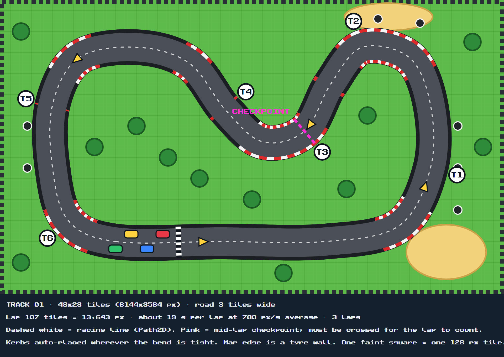

- **64 × 40 tiles** (8192 × 5120 px), a figure-of-eight, lap ≈ **176 tiles / 22,600 px**, about
  **24 s** for the AI — a bit over a minute for three laps.
- The start straight leads up over the bridge, down round the right-hand loop (T1–T3), back under
  the bridge and round the left-hand loop (T4–T6) to the line. Sand traps sit in the corners, where
  mistakes happen.
- The circuit is defined **once**, in [`tools/layouts/tracks/track_01.json`](../tools/layouts/tracks/track_01.json)
  (§7.2). [`tools/layouts/track_layout.py`](../tools/layouts/track_layout.py) writes both this diagram and
  [`mockups/track_01_points.json`](mockups/track_01_points.json), which the game reads to build the
  racing line — so the reviewed layout and the driven track cannot drift apart.

### 7.2 Building the track: spline road over a tile map

Decided after [`mockups/road_compare.png`](mockups/road_compare.png): tile terrain turns the hairpin
into a jagged octagon, while a road drawn from the spline keeps frame 04's smooth sweep. So the
track is two layers:

- **Ground — a `TileMapLayer`.** Grass, sand traps and decoration, painted by hand in Godot's
  TileMap editor. The fills are the flat procedural textures (§11.1); the grass↔sand edge pieces
  are composited by script from those fills, so every edge matches.
- **Road — built from the spline.** A `Path2D` holds the racing line, defined by the control
  points in `tools/layouts/track_layout.py`. From it the track scene builds, in `_ready()` and as
  an editor tool so it is visible while editing:
  - the asphalt as a `Polygon2D` (the curve offset ±192 px, textured with the asphalt fill);
  - the kerbs as `Line2D`s along both road edges, textured with the kerb strip in tile mode, so
    the red/cream blocks follow every bend at an even spacing — only where the bend is tight;
  - the lane dashes and the chequered start/finish line.

  Moving a control point moves the road, the kerbs, the racing line and the surface detection
  together. Nothing about the road is painted by hand, so it can never disagree with the AI's line.
  Kerbs are continuous strips: gaps under 160 px between tight stretches are bridged and pieces
  under 320 px dropped, so gentle bends at the threshold do not fragment.

**Built:** [`screenshots/track_overview.png`](screenshots/track_overview.png),
[`screenshots/track_grid.png`](screenshots/track_grid.png).

| Piece | File |
| --- | --- |
| Ground tileset: 16 corner tiles, Grass/Sand terrain in Match Corners mode | [`tools/layouts/build_tileset.py`](../tools/layouts/build_tileset.py) → `art/tiles/ground_atlas.png`, `track/ground_tiles.tres` |
| Track logic and road drawing (`@tool`, so the road also shows in the editor) | [`track/track.gd`](../track/track.gd) |
| Scene builder: layout points → `track_01.tscn` (curve, painted sand traps, grid, gates, walls, trees, tyre stacks) | [`track/build/build_track.gd`](../track/build/build_track.gd) |
| Checks: surfaces, progress, grid, gates | [`tests/track_test.gd`](../tests/track_test.gd) |

Inside a ground tile, sand is where the bilinear blend of its four corners exceeds 0.5. The tiles
are drawn with that rule and `Track.surface_at()` tests with it, so what you see is what you drive
on. Neighbouring tiles share corners, so edges continue across tile borders without a seam.

**Every track is data.** A track is a JSON spec in [`tools/layouts/tracks/`](../tools/layouts/tracks/):
map size, road width, control points, where the finish goes (the grid is placed behind it, along
the road), patches of the theme's patch surface, props by kind, and — as fractions of a lap — ice
on the road and boost pads. To change a track, or add one: edit or add its spec, then

```bash
python tools/layouts/track_layout.py            # diagrams + points for every spec
python tools/layouts/theme_art.py               # theme textures (only when themes change)
python tools/layouts/prop_art.py                # drawn props: Jungle, Candy, Moon (only when they change)
Godot_v4.7.1-stable_win64_console.exe --path . --headless res://track/build/build_track.tscn
```

`track_layout.py` also reports how close the road comes to itself and warns below a road width plus
a tile. Migrating Track 01 to a spec reproduced its points file field for field; the rebuilt scene
differs only by its theme and four grid-slot rotations of ~0.002 rad (the Phase 8 performance pass
changed the curve's bake interval in the scene without a rebuild).

Image generation makes none of this geometry — it is exactly what diffusion does worst. Generated
art is limited to the cars, props and UI illustrations.

### 7.3 Surfaces

The car checks what it is on every physics frame:

1. **On the road?** Distance from the car to the racing line (`Curve2D.get_closest_point`) is under
   the road's half-width → asphalt. Kerbs count as asphalt.

The track, not the car, does this: each physics frame it sets the surface multipliers of every
node in the `cars` group and emits `CAR_surface_changed` when a car's surface changes. Cars stay
unaware of tracks.
2. **Otherwise**, the ground tile beneath it, read from the TileSet's custom data layer `surface`.

| Surface | `speed_mult` | `lateral_grip` × | Feel |
| --- | --- | --- | --- |
| Asphalt / kerb | 1.0 | 1.0 | Normal |
| Grass | 0.55 | 0.7 | Slow and a bit loose — get back on |
| Sand | 0.4 | 0.6 | Sticky and slow, but you drive out |
| Beach | 0.6 | 0.65 | Sunny Beach's ground: softer than a sand trap, it is the easy track |
| Snow | 0.6 | 0.55 | Snowy Peak's ground |
| **Ice** | **1.0** | **0.35** | Full speed, almost no grip — drift heaven, never a stop. Ponds off the road, and spans *on* it |
| Jungle | 0.55 | 0.7 | Jungle Run's ground: like grass |
| Mud | 0.4 | 0.55 | Jungle Run's puddles: a sand trap that also slides |
| Candy | 0.6 | 0.65 | Candy Lane's icing: soft, like the beach |
| Chocolate | 0.45 | 0.6 | Candy Lane's puddles: gooey |
| Moon dust | 0.6 | 0.45 | Moon Base's ground: floaty, the car slides wide |
| Crater | 0.45 | 0.45 | Moon Base's craters: deeper dust |

On the road, a span of ice (`Track.ice_spans`, fractions of a lap) overrides asphalt; it is drawn
as translucent sheet ice so the road still reads as road. Each car's off-road ability (§4.2)
softens the off-road surfaces. The map edge is a wall of the theme's prop (tyres, beach balls,
traffic cones): solid, but it slides you along it.

**Boost pads** (Toy Town) are `Area2D`s across the road: driving over one gives 1.2 s of extra push
(1,800 px/s²) and lets the car go 30 % past its top speed, fading over the last third, and emits
`CAR_boosted` (a whoosh). The track test checks a boosted car passes its top speed.

### 7.4 Progress and laps

- **Progress** is distance along the racing line: `progress = laps × lap_length +
  curve.get_closest_offset(position)`. One number per car, sorted every frame for live positions.
- **Lap validation** uses two `Area2D`s: the mid-lap checkpoint must be crossed before the
  start/finish line counts. This blocks reverse driving and cutting across the infield.

### 7.5 Themes

A theme ([`TrackTheme`](../game/configs/track_theme.gd), one `.tres` per theme in `game/configs/themes/`)
is the look and the ground of a track: the ground tiles, which surface is everywhere off the road
(`base_surface`) and which one the painted patches are (`patch_surface`), the road and kerb
textures, the edge-wall prop, and the colour of its card. Its textures come from
[`tools/layouts/theme_art.py`](../tools/layouts/theme_art.py) and
[`themes.json`](../tools/layouts/themes.json): flat procedural fills (snow, ice and beach joined
grass and sand in `pipeline.json`), the kerb strip in the theme's colours, and the 16-tile corner
atlas of base and patch — the same corner rule as Track 01, so surfaces match what is drawn. Toy
Town shares the meadow's tiles. Meadow's outputs are byte-identical to the originals.

| Theme | Base / patch | Kerbs | Wall | Props (generated, picked from four) |
| --- | --- | --- | --- | --- |
| Meadow | grass / sand | red / cream | tyres | tree, tyre stack |
| Sunny Beach | beach / grass dunes | blue / white | beach balls | palm tree, parasol, beach ball |
| Snowy Peak | snow / ice | red / white | tyres | pine tree, snowman |
| Toy Town | grass / sand | yellow / blue | traffic cones | toy house, traffic cone, tree |
| Jungle Run | jungle / mud | orange / yellow | boulders | jungle tree, flower, boulder (drawn by script) |
| Candy Lane | candy / chocolate | mint / white | gumdrops | lollipop, donut, cupcake, gumdrop (drawn by script) |
| Moon Base | moon dust / crater | charcoal / yellow | moon rocks | rocket, dish aerial, moon rock (drawn by script) |

The last three themes' props ([`mockups/props_jungle_candy_moon.png`](mockups/props_jungle_candy_moon.png))
were not generated: ComfyUI was not to hand when they were added. [`tools/layouts/prop_art.py`](../tools/layouts/prop_art.py)
draws each one as a stack of flat shapes, gives every shape a pillowy height from its own blurred
outline and lights the height field from the top left, which gets close to the generated props'
soft clay look; the Starlight Cup's star icon is drawn the same way. Seeded, so a rebuild is
byte-identical. Their FLUX versions can replace them file for file.

Two props needed a second prompt: "seen from directly above" still drew the snowman and the house
from the front, like stickers standing up. Describing the shape from above instead ("a big round
snowball seen from the top as a circle, a black top hat at the centre"; "the roof … no walls and no
door visible") gave true top-down pictures that sit in the world like everything else.

### 7.6 Track select and unlocking

RACE! in the garage opens **PICK A TRACK** ([`screenshots/track_select.png`](screenshots/track_select.png)):
a scrolling row of cards (the focused one kept in view) with the track's shape drawn from its racing line, its name, and the best lap, NEW! or —
while locked — a padlock and "FINISH <the track before>". A track opens when the one before it has
been finished **in any place**: a child is never stuck behind a race they cannot win. The choice is
saved (`selected_track` in the profile; older saves start on the first track), RACE AGAIN on the
results screen re-races it, and every track's first finish pays its +100 bonus. Each track has its
own opponents in its own cars ([`game/configs/tracks/`](../game/configs/tracks/)), always blue,
yellow and green.

The balance report runs per track (`--track`); the race test's "sensible lap" bound scales with
the lap length. On the longer tracks a struggling child reaches the podium with every car on every
track but one pairing: the slowest car driven slowest — the Ice-Cream Van at 0.7 pace — finishes
4th on Meadow Loop, 7.6 s back (3rd elsewhere, up to 9 s back on Snowy Peak). Small pace gaps add
up over longer laps; Easy difficulty is the answer for that child. The top-speed cars (Banana,
Formula, Dragon) win clean races by 3–5 s; the autopilot never pays their slipperiness the way a
child does.

### 7.7 Bridges

Where a track's line crosses itself, one pass goes over the other on a bridge. The spec names the
upper pass (`"bridges": [{"upper_at": 0.13, "length_tiles": 20}]`, the lap fraction where it
crosses); `track_layout.py` finds every crossing, centres the span on that pass, and warns about a
crossing with no bridge or a finish line, checkpoint, boost pad or ice patch on or by one (the
checkpoint moves itself forward off a bridge). It reports the crossing angle: 63–90° on the three
bridges, so the levels clearly read as one road over another.

| Problem | Answer |
| --- | --- |
| Race position at the crossing: the closest point on the line is ambiguous where two passes meet | `Track` measures each car by searching only a short window of the line (±12 baked points, 240 px) around where it was last frame, so a car keeps to its own pass. A full search runs only when a car is new or was moved (a rescue). Also cheaper: CPU per race frame fell from 249 to 208 µs |
| Two levels | A car within a bridge span and on the road is **level 1**: drawn above the deck (`z_index` 2; the deck is 1), on its own physics layer. Drawing switches 120 px (more than half a car) *before* the deck starts and *after* it ends, collisions at the span itself — first built switching both at once, which cut the car in half at both ends of the deck for a frame (reported in play, now checked by the track test). Cars on the two levels never collide; cars on the same level still bump |
| Falling off | Solid **railings** along the high middle of each span, on a layer only level-1 cars collide with, so cars below drive under them. Skid marks laid on a bridge lie on its deck |
| Looking like a bridge | The deck redraws the road above everything below it, with white railings and a shadow on the ground; the AI ignores cars on the other level when choosing its lane |

[`tests/track_test.gd`](../tests/track_test.gd) drives a car over Meadow Loop's bridge (ground →
bridge → ground, its progress never jumping to the other pass), and checks the two levels pass
through each other, the same level still collides, and the railing stops only a bridge car.

The longer tracks moved the save to **schema 3**: best laps from older saves belonged to the short
tracks and are dropped; coins, cars and paint are kept.

## 8. AI and the race

### 8.1 AI drivers

Each AI car runs [`actors/car/ai_driver.gd`](../actors/car/ai_driver.gd), writing the same three
inputs a player would:

1. **Steer** at a point on the racing line 150 px + 0.3 s of speed ahead, shifted sideways into
   its own lane (−70 / 0 / +70 px), so the pack does not drive in single file.
2. **Read the road ahead** — the sharpest bend in the next 250 / 500 / 800 px sets a target speed
   between its straight pace (0.80 + 0.15 × skill of its top speed) and corner pace (0.45 + 0.15 ×
   skill of the *base* car's top speed, times its setup's steering multiplier); it lifts or brakes
   to meet it. Corner speed follows how fast the car turns, not how fast it goes: a Kart carries
   more speed through a bend, a Rocket must lift more. Opponents drive the base car, so for them
   nothing changes; it matters when the player's car is on autopilot for the balance pass (§8.3).
3. **Avoid** — a car close in front pushes it into the other half of the road until clear.
4. **Never strand** — stuck (slow with the throttle down) for 1.2 s, it backs out steering the
   other way; after three back-outs, or 900 px off the line, it is put back on the line. The race
   test expects no rescues in a normal race, and sees none.
5. **Skill** — 0.85 / 0.70 / 0.55 for Blue / Yellow / Green on Track 01
   ([`game/configs/tracks/track_01.tres`](../game/configs/tracks/track_01.tres)).
6. **Their cars** — opponents drive garage cars in their own colour: Blue a blue-painted Police Car,
   Yellow the Banana, Green the Dragon — a preview of what the garage sells. An opponent's car sets
   its handling, acceleration and look, but its **pace comes from the base car**
   (`AIDriver.pace_from_base`), so difficulty does not depend on which car it wears: with pace from
   its own car, a Banana-driving opponent left a child in the Ice-Cream Van 7 s behind. The player's
   autopilot (balance tests) paces from its own car, so each car's speed still shows.

### 8.2 Race flow

[`RaceManager`](../game/managers/race_manager.gd) holds the cars still through 3-2-1-GO, then:

- **Laps** count on the finish line only after the mid-lap checkpoint. The grid is behind the
  line, so the first crossing *starts* lap 1. Lap 1 is timed from GO.
- **Positions** sort finished cars by finish time, the rest by progress (laps × lap length + distance
  past the line; negative on the grid).
- **The race ends when the player finishes** (after a 2.5 s FINISH! moment). Opponents still racing
  get a time from their average pace carried over the distance left, so a child never waits on a
  race that is over for them. Results go out on `RAC_race_finished`; `GarageManager` pays out.
- The player starts **3rd of 4** — something to chase, nobody to lap.

### 8.3 Rubber-banding and the balance pass

Each AI's pace is scaled by how far it is from **where it wants to be**: 1,500 px ahead of that
spot it eases to **60 %**, the same distance behind it pushes to **112 %**, and may then pass its
own top speed by as much (`Car.catch_up_mult`), so a player on a faster setup cannot simply drive
away. Where it wants to be: level with the player for Blue, the best driver; the others hang back
5,000 px per point of skill below 0.85, so Yellow 750 px and Green 1,500 px. The best opponent
always makes the player work for a win, and the weaker two leave room on the podium for a child who
is still learning ([`race_manager.gd`](../game/managers/race_manager.gd)).

These numbers are **Normal**. The settings screen's OPPONENTS switch picks one of three
[`DifficultyConfig`](../game/configs/difficulty_config.gd) resources, which shift every
opponent's skill and retune the band:

| Difficulty | Skill | Ease off / push | Hang back per skill point | Struggling child (0.7) | Clean driving |
| --- | --- | --- | --- | --- | --- |
| Easy | −0.10 | 55 % / 110 % | 6,000 px | 2nd by a few tenths with Starter, wins with the faster setups | wins by ~2 s |
| Normal | — | 60 % / 112 % | 5,000 px | 3rd | wins by ~1 s |
| Fast | +0.10 | 75 % / 115 % | 2,500 px | 4th, 2–6 s back | a close fight for 1st |

Tuned with [`tools/dev/balance_report.py`](../tools/dev/balance_report.py) (`--difficulty`), which races every setup
with the player's car on autopilot at three paces: 1.0 = clean driving, 0.85 = a decent child,
0.7 = a struggling one. Each cell is the player's place and the gap to the winner (negative = the
winning margin). Runs are deterministic, so before and after compare directly.

Before Phase 8 (70 % / 1,800 px, every AI banded level with the player, capped at its own top
speed):

| Setup | 1.0 | 0.85 | 0.7 |
| --- | --- | --- | --- |
| Starter | 2nd +0.2 s | 4th +1.0 s | 4th +2.8 s |
| Grippy | 2nd +0.3 s | 4th +1.4 s | 4th +4.1 s |
| Slider | 2nd +0.1 s | 4th +1.2 s | 4th +3.0 s |
| Rocket | 1st −4.3 s | 1st −0.6 s | 4th +1.1 s |
| Kart | 4th +0.6 s | 4th +2.2 s | 4th +7.1 s |
| Banana | 1st −4.5 s | 1st −0.8 s | 3rd +0.8 s |

Three problems: a decent child came last on every setup but the two fastest; Rocket and Banana won
by over 4 s, because nothing could catch them on the straights; and Kart looked strictly worse, only
because the autopilot ignored its sharper steering. Shipped:

| Setup | 1.0 | 0.85 | 0.7 |
| --- | --- | --- | --- |
| Starter | 1st −0.8 s | 2nd +0.4 s | 3rd +1.4 s |
| Grippy | 1st −0.6 s | 2nd +0.6 s | 3rd +1.5 s |
| Slider | 1st −1.0 s | 3rd +1.0 s | 3rd +1.5 s |
| Rocket | 1st −1.7 s | 1st −0.1 s | 3rd +1.0 s |
| Kart | 1st −0.8 s | 2nd +0.6 s | 3rd +1.3 s |
| Banana | 1st −3.0 s | 1st −0.5 s | 2nd +0.6 s |

Clean driving wins narrowly on anything; a decent child fights for 2nd and 3rd; a struggling child
reaches the podium.

With twelve cars and opponents in roster cars (Phase 10), Normal:

| Car | 1.0 | 0.85 | 0.7 |
| --- | --- | --- | --- |
| Starter | 1st −0.6 s | 2nd +0.6 s | 3rd +1.6 s |
| Grippy | 1st −0.4 s | 2nd +0.7 s | 3rd +1.8 s |
| Ice-Cream Van | 2nd +0.4 s | 3rd +1.3 s | 3rd +2.5 s |
| Slider | 1st −0.7 s | 2nd +0.5 s | 3rd +1.5 s |
| Rocket | 1st −1.3 s | 2nd +0.1 s | 2nd +1.0 s |
| Kart | 1st −0.5 s | 2nd +0.7 s | 3rd +1.5 s |
| Monster Truck | 2nd +0.2 s | 2nd +1.1 s | 3rd +2.4 s |
| Bubble Car | 1st −1.0 s | 2nd +0.5 s | 3rd +1.3 s |
| Police Car | 1st −1.5 s | 2nd +0.1 s | 2nd +1.0 s |
| Banana | 1st −2.6 s | 1st −0.4 s | 2nd +0.8 s |
| Formula | 1st −2.4 s | 1st −0.2 s | 3rd +1.0 s |
| Dragon | 1st −3.3 s | 1st −0.4 s | 2nd +0.7 s |

The Formula first won clean races by 6.2 s and was cut back (top speed 1.3 → 1.2, steering
1.1 → 0.95: fastest on straights, but it must brake for bends); the Dragon by 4.2 s (1.25 → 1.2).
The slow, steady cars (Ice-Cream Van, Monster Truck) are the easy-to-drive end, never last. Setups are worth buying without trivialising the race. The autopilot never
uses the handbrake, so the table cannot show what a slippery setup costs a child in control:
Banana's margin is deliberately the largest because it is also the hardest car to keep on the road.

## 9. Garage and economy

### 9.1 Earning

| Finish | Coins |
| --- | --- |
| 1st | 100 |
| 2nd | 75 |
| 3rd | 60 |
| 4th | 50 |
| First time finishing a track | +100 once |

Owning all twelve cars costs **4,300 coins**: at the ~65 coins a race a decent child earns, a new
car every three to five races early on, and the Dragon as a long-term goal. The cups of Phase 12 add
income on top.

The Phase 8 balance pass left these numbers alone: with the retuned rubber-banding a decent child
finishes 2nd or 3rd (60–75 coins), which keeps the pacing below. The floor is deliberately generous: a child finishing last every time still affords **Grippy**
after two races and a 250-coin setup after about five. Winning just gets there faster. All of
these numbers live in one `EconomyConfig` resource.

### 9.2 Save file

A `ConfigFile` at `user://vicky_racer.cfg`:

```ini
[profile]
schema_version=2
coins=240
owned_setups=PackedStringArray("starter", "slider")
equipped_setup="slider"
completed_tracks=PackedStringArray("track_01")

[best_laps]
track_01=38.90
```

`completed_tracks` records which tracks have paid their one-off first-finish bonus. Schema **2**
(Phase 10) adds a `[paint]` section, car id = colour; version 1 files load as they are and are
written back as version 2.

Loading is defensive: a missing, unreadable or unknown-version file yields a fresh profile instead
of an error, and an unreadable file is kept as `vicky_racer.cfg.bak` rather than overwritten.
Values are sanitised on load — negative coins become 0, Starter is always owned, and an equipped
setup the player does not own falls back to Starter. A broken save must never stand between a
child and the game.

A purchase equips the setup straight away: a child who just bought something wants to drive it.

Implemented in [`game/save_game.gd`](../game/save_game.gd) and
[`game/managers/garage_manager.gd`](../game/managers/garage_manager.gd); checked by
[`tests/economy_test.gd`](../tests/economy_test.gd), which also proves the design promise that two
last places afford Grippy.

### 9.3 Paint shop

Every owned car can be painted, free, as often as the child likes: X / C in the garage cycles the
focused car through **original → blue → yellow → green → purple → pink**, and the card, the preview
and the race car all change. The paint is saved per car. The 57 paint jobs (12 cars × 5 colours,
less the three that already existed as the opponents' recoloured Starter cars) are Kontext
recolours of each car's master, declared in one `paints` section of
[`asset_manifest.json`](../tools/comfy/asset_manifest.json); `generate_assets.py paint-sheet` lays
them all out ([`mockups/candidates/paint_shop.png`](mockups/candidates/paint_shop.png)).
[`Paint`](../game/configs/paint.gd) maps a car and a colour to its card and race body.

## 10. Screens

| Screen | Spec |
| --- | --- |
| Title | [`mockups/title_layout.png`](mockups/title_layout.png) — logo, PLAY / SETTINGS / QUIT over a live attract-mode race (four AI cars on Track 01, no HUD, no engine sounds). Built: [`screenshots/title.png`](screenshots/title.png) |
| Pause | [`mockups/pause_settings_layout.png`](mockups/pause_settings_layout.png) — Esc / Start or the window losing focus pauses the whole tree. RESUME is focused, so pausing twice resumes; B resumes too; RESTART and GARAGE ask SURE? with NO focused. Built: [`screenshots/pause.png`](screenshots/pause.png) |
| Settings | Same spec — SOUND, MUSIC, FULLSCREEN, AUTO GO, STEER HELP, OPPONENTS; one focusable row each, ← → change it. Over the title and over the pause menu. Built: [`screenshots/settings.png`](screenshots/settings.png) |
| Race HUD | [`mockups/hud_layout.png`](mockups/hud_layout.png) — position, lap, timers, speed bar, minimap, countdown. Built: [`screenshots/race.png`](screenshots/race.png), [`screenshots/race_countdown.png`](screenshots/race_countdown.png). The countdown sits above screen centre rather than on it, so it never hides the player's own car |
| Garage | [`mockups/garage_layout.png`](mockups/garage_layout.png) — balance, cards in pages of 3 × 2 (Q / E or the shoulder buttons, or moving off the edge of a page, turns it; `< 1 / 2 >` above the cards), preview with Grip / Slide / Speed bars and, for owned cars, paint swatches. Built: [`screenshots/garage.png`](screenshots/garage.png) |
| Pick a race | RACE / TIME TRIAL switch (§16), a row of track cards (§7.6) and a row of cup cards (§12), each scrolling sideways with the focus. ← → ↑ ↓ choose, A races, B back to the garage. Built: [`screenshots/pick_a_race.png`](screenshots/pick_a_race.png) |
| Standings, podium | §12 |
| Two players | §15 — 2 PLAYERS on the title: the join screen, then PICK A RACE and a split-screen race. Built: [`screenshots/join.png`](screenshots/join.png), [`screenshots/split_screen.png`](screenshots/split_screen.png) |
| Trophy shelf | §14 — the trophy button right of PLAY on the title. Built: [`screenshots/shelf.png`](screenshots/shelf.png) |
| Results | [`mockups/results_layout.png`](mockups/results_layout.png) — finishing order, payout count-up, Race Again. Built: [`screenshots/results.png`](screenshots/results.png) |

Pink annotations on each spec give anchors, sizes and animation timings; they are meant to be
built verbatim with `Control` anchors. All menus are fully navigable with a gamepad alone.

### 10.1 Settings file

`user://vicky_settings.cfg`, separate from the save game: settings belong to the computer and
the person at it, progress belongs to the child, and neither should be able to break the other.
[`Settings`](../game/settings.gd) validates every value on load and on change (volume clamped and
snapped to 10 % steps, unknown keys and mistyped values ignored), so a hand-edited file falls back
to defaults rather than failing. [`SettingsManager`](../game/managers/settings_manager.gd) applies
and saves each change at once. Sound goes through an `SFX` bus and music through a `Music` bus
(`default_bus_layout.tres`), set by SOUND and MUSIC (default 80 % and 60 %). Checked by [`tests/front_end_test.gd`](../tests/front_end_test.gd).

The HUD takes race state from the `RAC_` signals. The speed bar and the minimap are the exception:
the race screen hands them the cars, because they need positions every frame and no signal should
carry that 60 times a second.

## 11. Art direction and asset pipeline

**Style anchor: frame 04, "picture book".**

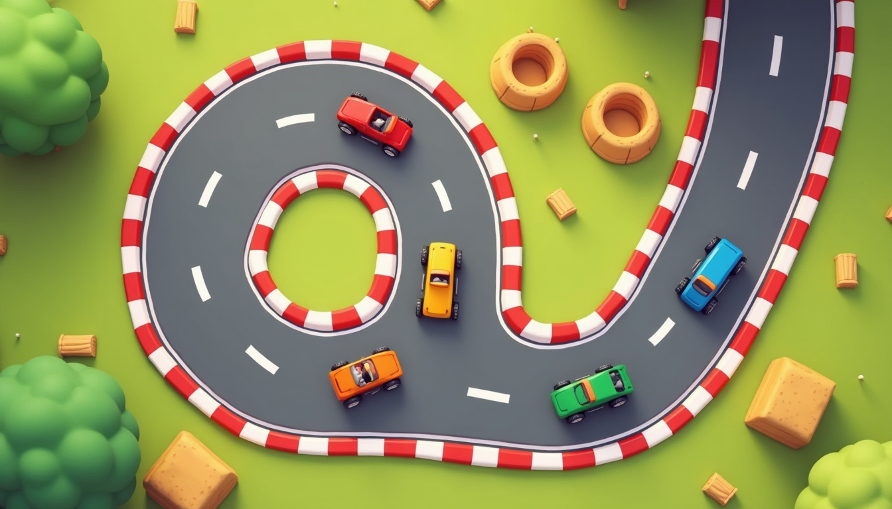

Soft, rounded, friendly shapes in warm bright colours; no hard black outlines; a near-overhead
camera, which suits top-down sprites. Generated by FLUX.1-dev at 1344 × 768, seed **202**, guidance
3.5, 20 steps, euler / beta, with the prompt:

> top-down view from directly above of a winding race track for a children's racing video game:
> grey asphalt road with red and white kerbs, green grass, a few round trees, tyre stacks and hay
> bales, four small colourful race cars (red, blue, yellow, green) driving around a bend, 2D video
> game screenshot, soft flat children's picture book illustration, rounded friendly shapes, warm
> bright flat colours, no outlines

What the frame gets right, and production assets must keep: rounded cartoon proportions, warm
saturated greens and greys, chunky red/white kerbs, props as soft simple blocks. What it gets wrong
and Phase 2 must correct: the soft 3D shading and drop shadows (FLUX's house style — the prompt
asked for flat), and the slight perspective on some cars. This image is the reference fed to
`ReduxAdvanced` when style-locking every asset.

Assets come from local ComfyUI through `tools/comfy/`:

| Asset | Count | Approach |
| --- | --- | --- |
| Player car | 1 | **Chosen: the sports car** (`mockups/raw/car_sports.png`, seed 11). Generated top-down, cut out with BiRefNet, rotated from its nose-down source to +X, fitted to 128 × 72 |
| Opponent cars | 3 | The player car repainted blue, yellow and green with FLUX Kontext — identical silhouette, proven in [`mockups/car_palette.png`](mockups/car_palette.png) |
| Ground fills | 3 | Asphalt, grass, sand — **procedural flat colour** sampled from the style anchor (the bake-off showed generated fills cannot tile) |
| Edge / corner tiles | ~16 per surface pair | Composited by script from the fills (§7.2) |
| Kerbs, finish line | 2 | Drawn — red/cream kerb strip and a chequer, both tileable |
| Props | 4 | Straw ring, hay bale, tree, tyre stack — generated + cut out, style-locked to the style board. The tyre stack's hole is punched out in post so the ground shows through |
| UI | 7 | Coin, and one card illustration per drift setup |

### 11.0 Production (Phase 3)

Every asset, its subject or edit instruction, pinned seed, facing, size and output path is in
[`tools/comfy/asset_manifest.json`](../tools/comfy/asset_manifest.json). Picks were made from four
candidates each ([`mockups/candidates/`](mockups/candidates/)); the whole set is shown together in
[`mockups/asset_overview.png`](mockups/asset_overview.png). To rebuild:

```bash
python tools/comfy/generate_assets.py build            # reuse cached masters
python tools/comfy/generate_assets.py build --force    # re-render everything from seeds
```

### 11.1 The frozen recipe (Phase 2)

Five bake-off rounds ([`mockups/bakeoff/`](mockups/bakeoff/)) settled the recipe in
[`tools/comfy/pipeline.json`](../tools/comfy/pipeline.json):

| Setting | Value | Why |
| --- | --- | --- |
| Model | FLUX.1-dev, fp8 weights | SD3.5 was faster but gritty and realistic. bf16 was not reproducible at 1536 px |
| Size | 1536 px, downscaled to sprite size | The softest, most anchor-like finish of any setting |
| Style lock | Redux on the **style board**, factor 4.5 / weight 0.75 | The full style frame leaked its track into every asset; the board is frame 04's objects only |
| Steps | 20 | 30 steps added nothing visible |
| Cut-out | BiRefNet-general | `toonout` kept shadows, filled the straw ring's hole and kept a dirt rim on trees |
| Picking | 4 candidates per asset, best one pinned | Quality over speed |

The recipe is **verified reproducible**: an identical request regenerates pixel-identically, so a
pinned seed fully defines an asset. Prompt lessons — how to get props truly top-down, and that car
facing is unreliable and must be recorded per asset — are kept in `pipeline.json` itself.

### 11.2 Sound (Phase 8)

Six sounds are generated with **Stable Audio 3** through the same ComfyUI client, declared with
prompts and pinned seeds in [`tools/comfy/sfx_manifest.json`](../tools/comfy/sfx_manifest.json) and
built by [`tools/comfy/generate_sfx.py`](../tools/comfy/generate_sfx.py) into `art/sfx/` as mono
16-bit WAVs. Recipe: `stable_audio_3_medium_base`, 50 steps, cfg 7. A bake-off on a tyre-squeal
probe found it gave the cleanest tonal squeal; `small_sfx` is distilled (cfg 1 only) and noisier.
Four candidates per sound were picked from spectrogram sheets in [`mockups/sfx/`](mockups/sfx/).
One-shots are trimmed and faded; the two loops (engine, squeal) are cut from the steadiest stretch
of their clip and cross-faded so they repeat without a click, and imported with looping on. The
countdown beeps are synthesised: a pure tone is what they need.

```bash
python tools/comfy/generate_sfx.py candidates [--only coin]   # render candidates + review sheet
python tools/comfy/generate_sfx.py pick coin 104              # pin a seed
python tools/comfy/generate_sfx.py build                      # write art/sfx/*.wav
```

## 12. Cups

A **cup** is three races in a row with points, standings and a trophy at the end.

| Cup | Races | Opens |
| --- | --- | --- |
| **Sunshine Cup** | Meadow Loop, Sunny Beach, Toy Town | from the start |
| **Snowflake Cup** | Toy Town, Meadow Loop, Snowy Peak | when the Sunshine Cup has been **won** (1st overall) |
| **Starlight Cup** | Jungle Run, Candy Lane, Moon Base | when the Snowflake Cup has been **won** |

- **Points** 10 / 7 / 5 / 3 per race, so everyone scores; a tie goes to whoever did better in the
  last race.
- **Flow:** PICK A RACE → a cup card → race → results (RACE AGAIN becomes STANDINGS) →
  standings, the points just won counting up → NEXT RACE … → after the last race PODIUM!
  ([`screenshots/cup_standings.png`](screenshots/cup_standings.png),
  [`screenshots/cup_podium.png`](screenshots/cup_podium.png)).
- **Podium:** the top three cars on a 2-1-3 podium, confetti, the fanfare, then the player's prize
  flies in: **gold / silver / bronze** trophy for 1st–3rd overall, the **ribbon** for 4th — finishing
  a cup is always celebrated, and always pays: **300 / 200 / 150 / 100** bonus coins
  (`EconomyConfig.cup_bonus`) on top of the normal per-race payout.
- **The next cup opens only on a win.** This is stricter than the tracks (which open on any
  finish) — the user's call: the cups are the goal for a child who can already win races. Easy
  difficulty (§8.3) is the route for a child who cannot yet. A trophy is never lost: a cup keeps
  the best ever won.
- **Leaving and resuming:** the progress is saved after every race, so leaving through the pause
  menu, the standings' GARAGE button or closing the game keeps the cup. The cup card then says
  CONTINUE — RACE 2 OF 3, and the title screen shows CONTINUE CUP. Starting a cup again from its
  card starts it over. A race left half-way scores nothing and is raced again.

| Piece | File |
| --- | --- |
| `CupConfig` — name, icon, tracks, points | [`game/configs/cup_config.gd`](../game/configs/cup_config.gd), `game/configs/cups/*.tres` |
| `CupManager` — phases none → racing → results → … → done, points, standings, trophy; in the shell next to `GarageManager` | [`game/managers/cup_manager.gd`](../game/managers/cup_manager.gd) |
| Standings, podium | [`ui/cup/`](../ui/cup/) |
| Cup cards on PICK A RACE | [`ui/track_select/cup_card.gd`](../ui/track_select/cup_card.gd) |
| Checks: points, ties, resume after closing the game, trophies, coins, opening on a win only, a single race not counting, and a whole cup through the real screens | [`tests/cup_test.gd`](../tests/cup_test.gd) |

`CupManager` owns the cup's logic and `GarageManager` its saving: after each race the manager
sends `CUP_progress_changed` (saved as `[cup] progress`), and at the end `CUP_finished` (cup,
standings, trophy), on which `GarageManager` pays the bonus and records the trophy in
`[trophies]`. Both sections are optional in the save, so the schema version did not change.

The art — gold trophy, ribbon, sun and snowflake icons — was generated and picked from four
candidates each; silver and bronze are Kontext recolours of the gold one, so all three trophies
share one shape. Reverse tracks (in the roadmap) were left out: four tracks gave two cups of three,
and the three themes added later (§7) make the third, the Starlight Cup, with a drawn star icon (§7.5).

## 13. Music

Every screen has music, generated like the sound (§11.2) with **Stable Audio 3**, declared in
[`tools/comfy/music_manifest.json`](../tools/comfy/music_manifest.json) and built by
[`tools/comfy/generate_music.py`](../tools/comfy/generate_music.py) into `art/music/` as stereo
Ogg Vorbis (about 6 MB in all).

| Piece | Plays on | Tempo, loop |
| --- | --- | --- |
| `menu` — ukulele, glockenspiel, whistling | title, garage, pick a race, results | 108 BPM, 16 bars after a 2-bar lead-in |
| `race_meadow` — banjo, fiddle, country pop | Meadow Loop | 132 BPM, 16 bars |
| `race_beach` — steel drums, surf guitar, calypso | Sunny Beach | 126 BPM, 16 bars |
| `race_town` — toy piano, marimba | Toy Town | 136 BPM, 16 bars |
| `race_snow` — sleigh bells, celesta, pizzicato | Snowy Peak | 128 BPM, 16 bars |
| `race_jungle` — marimba, kalimba, bongos *(synthesised)* | Jungle Run | 120 BPM, 16 bars |
| `race_candy` — music box, glockenspiel, toy organ *(synthesised)* | Candy Lane | 132 BPM, 16 bars |
| `race_moon` — synth arpeggios, square lead, lydian *(synthesised)* | Moon Base | 124 BPM, 16 bars |
| `standings` — a 3-second marimba sting, then `menu` | cup standings | once |
| `podium` — brass fanfare, timpani | cup podium (replaces the finish fanfare there) | 112 BPM, 8 bars after a 2-bar fanfare |

**Recipe.** `stable_audio_3_medium_base`, 50 steps, **cfg 6**: in a probe at 120 BPM it held the
prompted tempo exactly and had the firmest beat of the installed models; at cfg 7 two of three
seeds clipped. ACE-Step, named in the roadmap, turned out not to be installed and was not
compared. Six candidates per piece.

**Loops cut to whole bars.** The loop length starts as the prompt's `bars` at its tempo and is
refined (±0.5 %) to the lag at which the music best matches itself; the loop starts on the beat
whose surroundings sound most like the music one loop later, and is lined up to the sample across
the seam. The file keeps `intro_bars` of lead-in before the loop, and the last 60 ms before the
jump are cross-faded with the 60 ms before the loop start, so the seam is the same music both
ways. `build` writes a [`MusicPiece`](../game/configs/music_piece.gd) per piece
(`game/configs/music/*.tres`) with the stream, `loop_offset` and tempo; the game plays the file
from the top and Godot jumps back to `loop_offset` at the end. **Seam check:** the spectral jump
across the seam as played must be no larger than the music's own 95th-percentile jump from frame
to frame; `build` refuses a piece that fails. Every pick passes (0.24–0.87). Candidates are also
scored on tempo held, how well the loop matches and clipped samples; the scores and spectrograms
are on the sheets in [`mockups/music/`](mockups/music/).

**Synthesised, for the three later themes.** `race_jungle`, `race_candy` and `race_moon` were added
without ComfyUI to hand, so [`tools/comfy/synth_music.py`](../tools/comfy/synth_music.py) writes
them note by note: a four-chord progression, a bass line, drums and a lead built from the chords'
notes as a 4-bar phrase repeated A A' B A'', on small synthesised instruments (marimba, music box,
square lead and so on), levelled like the generated pieces. The 16 bars are rendered with what
rings past the end wrapped round to the start, so each loop is seamless from 0 s. They are
simpler than the generated pieces; their Stable Audio prompts are already in the manifest without
a seed (so `build` skips them), and `candidates`, `pick` and `build` replace them like any piece.

**Picked by ear.** `generate_music.py listen` writes MP3 previews of every candidate — lead-in, one
loop, then the jump back and 8 more seconds so the seam can be heard — and a page to compare them.
The picks in the manifest were made from the scores; swapping one is `pick` and `build`.

```bash
python tools/comfy/generate_music.py candidates [--only menu]   # render, cut, score, sheet
python tools/comfy/generate_music.py listen                     # previews + page to pick by ear
python tools/comfy/generate_music.py pick menu 103              # pin a seed
python tools/comfy/generate_music.py build                      # art/music/*.ogg + game/configs/music/*.tres
```

**[`MusicManager`](../game/managers/music_manager.gd)**, in the shell next to `SoundManager`:

- A screen change picks the screen's piece and cross-fades to it over a second; a piece shared by
  the next screen carries on rather than starting over. The race asks for its track theme's piece
  (`TrackTheme.music`, `UI_music_requested`).
- The 3-2-1 countdown ducks the music 10 dB under the beeps; GO brings it back.
- **Last lap** (`RAC_final_lap_started`, when the player starts it): the music speeds up 6 % —
  tempo and pitch together, about a semitone brighter.
- The finish fades the race music out, so the fanfare plays alone; the results bring the menu
  theme in.
- Pause ducks it 8 dB; it keeps playing under the pause menu.
- Under the dummy audio driver (headless) nothing plays, but `current` still follows, so the
  test can check it. Quitting fades it out first (see `main.gd`).

Checked by [`tests/music_test.gd`](../tests/music_test.gd): every piece is an Ogg stream that
loops past its lead-in on whole bars, every theme has its own race music, each screen's piece, the
menu not restarting between menu screens, ducking, last lap, finish, and the MUSIC setting on the
Music bus. Run with a window, it also checks the podium music is really playing.
[`tests/race_test.gd`](../tests/race_test.gd) checks the last lap is announced once.

## 14. Trophy shelf and stickers

Rewards a child who cannot read yet can see and collect. The **trophy button** beside PLAY on
the title opens the shelf ([`screenshots/shelf.png`](screenshots/shelf.png)): a playroom wall
with every cup's best trophy standing on a shelf over the cup's picture, and the sticker book
pinned to the wall above. Anything not won yet shows as a pale outline of itself, so the child can see what is still
to find. Moving over a prize names it, or says how to win it, for a grown-up to read out.

| Sticker | Earned by |
| --- | --- |
| **First Drift** | the first drift in a race |
| **Super Drift** | a drift of 3 seconds or more (`LONG_DRIFT_SECONDS`) |
| **First Win** | winning a race |
| **Careful Driver** | a lap with no wall hit |
| **Pile of Coins** | 200 coins or more from one race, the cup bonus included (`RICH_RACE_COINS`) |
| **Explorer** | having finished every track |
| **Car Collector** | owning every car |

The roadmap said **100** coins in one race, but a win alone pays 100, so that sticker would always
come with First Win. At 200 it takes a win on a track raced for the first time, or 2nd or better
in a cup (its bonus counts) — still reachable after every track has been finished.

- **A new sticker pops onto the screen** — [`StickerPopup`](../ui/stickers/sticker_popup.gd) in
  the shell, so it shows over any screen and carries on through a screen change. It bounces in big
  under the lap panel, above the middle of the screen (clear of the player's car), with NEW
  STICKER! ([`screenshots/sticker_popup.png`](screenshots/sticker_popup.png)), holds two seconds and shrinks away, with a pop-and-twinkle sound. Several at once (a
  win on a new track brings Pile of Coins and First Win) take turns.
- **[`StickerManager`](../game/managers/sticker_manager.gd)** in the shell decides: it watches
  the race and car signals for the player's own car (the one with a `PlayerMarker`) and only
  during a race, so the title's attract mode never earns anything, and the garage state for
  cars and tracks. It emits `PRO_sticker_earned`; `GarageManager` saves it.
- **Never twice, never lost.** The manager ignores anything already earned, the save keeps the
  list in an optional `[stickers] earned` (no schema bump), and nothing ever removes one.
- Stickers are data: a [`StickerConfig`](../game/configs/sticker_config.gd) per sticker in
  `game/configs/stickers/` (name, hint, picture); only the rules are code.

**Art.** Seven sticker pictures and the shelf wall, from four candidates each with the frozen
recipe. The white die-cut edge is not generated: `postprocess.sticker_border` grows each cut-out's
silhouette, fills its holes and puts it on white, so all seven share one edge. The wall is the
first full-screen picture through the recipe (`size` in the manifest: no cut-out, style-locked
like everything else, cropped to 1920 × 1080).

Checked by [`tests/sticker_test.gd`](../tests/sticker_test.gd): each sticker triggered, only by
the player and only in a race, exactly once, kept across closing the game; both drift stickers
with a real car's physics; a real race earning stickers; the popup queue; and the shelf from the
title showing exactly what was earned.

## 15. Two players, split screen

Racing with a parent or sibling on the same sofa. **2 PLAYERS** on the title opens the join
screen ([`screenshots/join.png`](screenshots/join.png)):

- **Joining by pressing.** Each player claims a device by pressing its button: **A** on a gamepad,
  **SPACE** for the left half of the keyboard (W A S D, Space drifts, E horn), **ENTER** for the
  right half (the arrows, Right Ctrl or Numpad 0 drifts, Right Shift horn). The first to press is
  player 1 (red), the second player 2 (purple). Any mix works: two gamepads, a gamepad and a
  keyboard half, or one keyboard shared.
- **Cars.** Each player picks from the cars the garage owns with their own left / right; player 1
  starts in the equipped car, player 2 in the next one owned, so the two look different. Each car
  wears its saved paint.
- **O / Y** switches the AI opponents off (two players alone) and on (two players and two AI).
- Pressing the join button again goes to PICK A RACE — tracks only: the cups are one child's
  progress. B goes back to the join screen, and B there (or any return to the title) ends the
  two-player game.

**[`PlayersManager`](../game/managers/players_manager.gd)** (in the shell, `PLY_` signals) holds
who plays on what, and binds each player's own actions — `p1_accelerate`, `p2_steer_left`, … — to
their device alone; [`PlayerInput`](../actors/car/player_input.gd) reads them through its
`action_prefix`. A one-player game keeps the shared actions, where every key and pad drives.

**The split** ([`screenshots/split_screen.png`](screenshots/split_screen.png)): two `SubViewport`s
side by side, left for player 1. The world — track, skid marks, cars — lives in the left one; the
right one shares its `World2D`, so it is one world seen by two cameras (player 2's chase camera
draws into the right view through `Camera2D.custom_viewport`). Each half has its player's HUD,
laid out mirrored about the middle — place on the outside edge, lap inside, speed bar in the
outside corner — with the timer left out, and one minimap sits between them at the bottom. Car
sounds are heard from player 1's view.

**The race:**

| Rule | Why |
| --- | --- |
| The players start side by side on the same grid row | neither starts ahead |
| The AI is rubber-banded to the player further behind | nobody is left racing alone |
| A player who finishes is driven on by the AI at an easy pace | their car never blocks the other |
| The race ends when both have finished, or 30 s after the first did (`LAST_PLAYER_WAIT`) | the winner is never kept waiting; the other gets an estimated time, like an opponent |
| Both places are paid into the one garage, each on its own line; a new track's bonus once | racing together still moves the family save on |
| The results name the better player: P1 WON! / P2 CAME 2ND! | always cheerful, as for one player |

Stickers can be earned by either player. **Performance:** on the development machine the split
race runs at the monitor's 100 fps (vsync), so there is no particle cut per view yet; a check on
the release machine belongs to Phase 17.

Checked by [`tests/two_player_test.gd`](../tests/two_player_test.gd): joining (a device once,
no third player, each action answering its own device only, the title ending it), the join
screen driven by key and pad events, a whole split race on autopilot (two views sharing one
world, a HUD each showing its own player's place, both players in the results and paid), and a
race with no opponents.

## 16. Time trial and ghosts

Something to come back to once the cups are won. PICK A RACE has a **RACE / TIME TRIAL** switch
above the track cards ([`screenshots/pick_a_race_time_trial.png`](screenshots/pick_a_race_time_trial.png));
in a time trial the cards show each track's record and the cups make way (a cup is always a
race). Two players have no time trial.

- **The run.** The player alone, three laps, the HUD without a place. Nothing is paid — there is
  nobody to beat but the clock — and the results list the laps with the best marked, then the
  record before and the gold ghost's time ([`screenshots/time_trial_results.png`](screenshots/time_trial_results.png)).
  The headline is NEW RECORD!, FASTER THAN GOLD! or GREAT DRIVING!; RACE AGAIN is TRY AGAIN.
- **Records.** The best lap per track, and per track *and car* (`[time_trial]` in the save:
  track = {best, setup, cars}). Lap 1 counts from GO, as the HUD's clock does, so it is rarely
  the best.
- **Ghosts** ([`screenshots/ghost_race.png`](screenshots/ghost_race.png)): two see-through cars
  set off each time the player crosses the line —
  - **gold**: the developer ghost, the autopilot at full pace in the Starter car, shipped as
    `game/configs/ghosts/<track>.res` and recorded by
    [`tools/dev/record_ghosts.tscn`](../tools/dev/record_ghosts.gd) (24.3 / 21.8 / 31.0 / 26.85 s);
  - **white**: the player's own record lap on the track, in the car and paint it was set in. A
    lap that beats it during the run becomes the ghost from the next lap on.
- **Recording.** [`GhostRecorder`](../actors/ghost/ghost_recorder.gd) samples the car on every
  physics tick from line to line, after the cars have moved: x, y and rotation as floats plus
  the draw layer as a byte (on a bridge the ghost is drawn above the deck too) — about 20 KB a
  lap. [`GhostCar`](../actors/ghost/ghost_car.gd) replays sample *k* on the *k*-th tick of the
  lap, so it is exactly where the car was; at another physics rate it blends the two nearest
  samples by time. It has no body and collides with nothing, and is drawn under the cars.
- **Files.** A record ghost is [`GhostLap.to_dict`](../game/ghost_lap.gd) written with
  `FileAccess.store_var`, which cannot hold objects, so a ghost file can never carry code; one per
  track beside the save (`user://vicky_racer_ghosts/`). A missing or broken file is simply no ghost.

Checked by [`tests/ghost_test.gd`](../tests/ghost_test.gd): the ghost data alone (samples, file
round trip, broken files, replay timing); a real time trial where the test traces the car itself
and the ghost of the best lap then drives that lap again **0.0000 px** from the trace, tick by
tick, over three laps; no coins, three laps reported, the record and the ghost saved, both
surviving a reload and the next run racing the saved ghost; and the switch on PICK A RACE.

## 17. Release build

A Windows build that starts from a desktop icon: **`VickyRacer.exe`**, one file of 125 MB with
the game inside (the pack embedded), running from any folder with no editor, ComfyUI or Python.

```bash
Godot_console.exe --path . --headless --export-release "Windows" build/windows/VickyRacer.exe
```

- **Preset** ([`export_presets.cfg`](../export_presets.cfg)): Windows x86-64, product name *Vicky
  Racer*, version **1.0.0** (`application/config/version`, also shown small on the title), the
  icon in the .exe. `tests/`, `tools/` and `docs/` are filtered out (and `tools/`, `docs/`
  are not even imported: `.gdignore`); `build/` is git-ignored. Needs the 4.7.1 export
  templates — only the Windows ones are installed here (the full set did not fit on C:).
- **Art** ([`tools/comfy/make_release_art.py`](../tools/comfy/make_release_art.py)), composed from
  approved assets, nothing newly generated: the icon is the red car racing up a road on a grass
  tile ([`art/ui/release/icon.png`](../art/ui/release/icon.png), `.ico` from 16 to 256 px); the boot
  splash is VICKY RACER in the title's font and colours over the car, shown at least 1.2 s.
- **Linux and macOS** are built only by the release workflow
  ([`.github/workflows/release.yml`](../.github/workflows/release.yml)), which has the full template
  set: Linux x86-64 (`VickyRacer.x86_64`, pack embedded) and a universal macOS `VickyRacer.app`
  (Intel and Apple silicon, so `import_etc2_astc` is on), pushed to itch.io as the `linux` and
  `mac` channels next to `web` and `windows`. The Mac app is ad-hoc signed, not notarised (that
  needs a paid Apple developer account): on first launch macOS refuses it, and the player opens it
  from System Settings > Privacy & Security > Open Anyway.
- **Boot polish:** the window is titled *Vicky Racer*. The project's internal name stays
  `VickyRacer`, because it names the save folder (`%APPDATA%/Godot/app_userdata/VickyRacer`) and
  renaming it would lose every save. Fullscreen was already remembered; now the window's size
  and position are too (`window_rect` in the settings file, kept on quit and before going
  fullscreen, restored only if that spot is still on a screen).
- **Found by exporting:** Godot 4.7's export converter left the `PackedColorArray` of opponent
  colours in the track configs **empty** in the .exe (every opponent's minimap dot turned black).
  They are an `Array[Color]` now, and a probe that loads all 45 config resources in the project
  and in the exported pack finds them identical.
- **Performance** (`tests/perf_probe.gd`, now with `--track=` and `--two-player`), on the
  development machine (RTX 5070 Ti), vsync off:

  | Case | Frame (uncapped) | Simulation per frame (headless) |
  | --- | --- | --- |
  | One player, Meadow Loop | 0.54 ms | 210 µs |
  | One player, Snowy Peak (ice) | 0.54 ms | 235 µs |
  | Two players split, Snowy Peak, four cars | 0.60 ms | 232 µs |

  The busiest moment uses under 4 % of a 60 fps frame, so nothing was cut. The probe now
  removes the pause menu (a window that never had focus paused the race mid-measurement), and
  reports paused frames. On an unknown machine: `VickyRacer.exe -- --fps`.
- **Playtest:** [`PLAYTEST.md`](PLAYTEST.md) — what to check before, what to watch for per
  pillar, and what to write down after.

## 18. Out of scope for v1

Ideas parked for later are listed in
[`ROADMAP.md`](ROADMAP.md). Touch controls remain out of scope.

## 19. Free Drive: the town

**TOWN** on the title screen opens Free Drive: no race, no laps, no timer, nobody to beat. The
child drives their own car (the one equipped in the garage, in its paint) round a little town
— and the town gets on with its day around them.

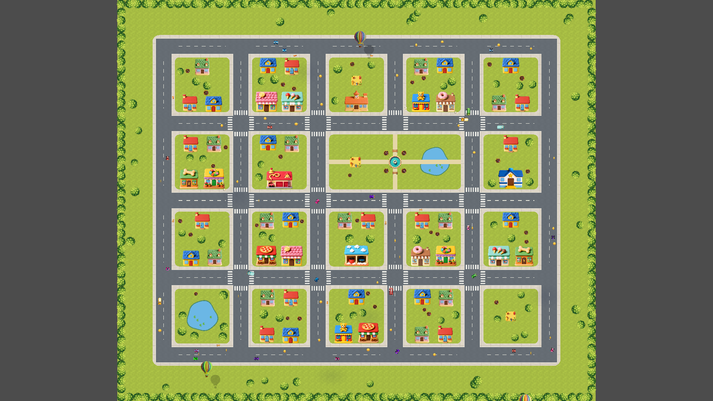

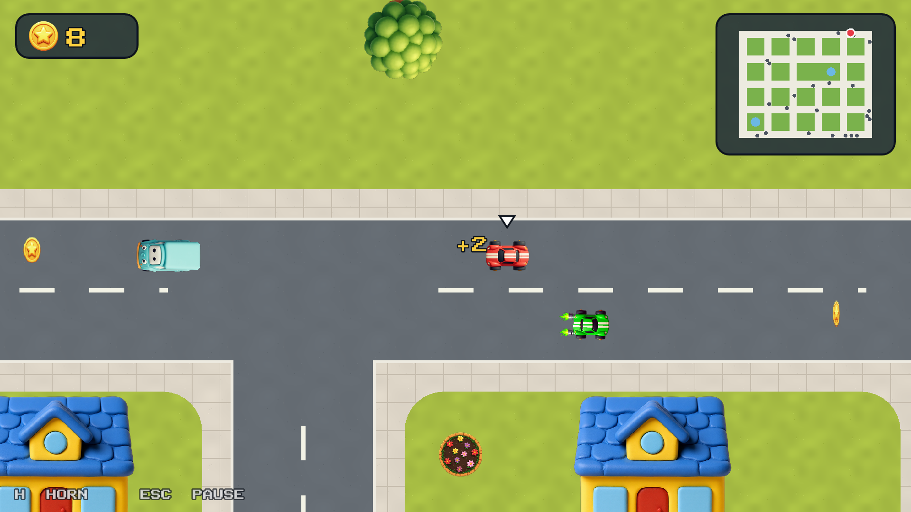

| Piece | What it is | File |
| --- | --- | --- |
| Layout | A grid of 5 × 4 blocks between two-lane streets, as data: which road is left out (the park is two blocks wide), and what stands in each block | [`town/town_layout.gd`](../town/town_layout.gd) |
| Town | Builds grass, pavements, streets, zebra crossings, buildings, the park, trees and the edge in `_ready`; sets surfaces; the traffic's map | [`town/town.gd`](../town/town.gd) |
| Screen | The player's car, traffic, animals, coins, sky; shop signs and the all-places bonus | [`game/screens/town.gd`](../game/screens/town.gd) |
| Traffic | A driver child for the same `car.tscn` every racer uses | [`actors/traffic/traffic_driver.gd`](../actors/traffic/traffic_driver.gd) |
| Animals | Dogs, cats, duck families | [`actors/town/walker.gd`](../actors/town/walker.gd) |
| Sky | Cloud shadows, hot-air balloons, flocks of birds | [`actors/town/town_sky.gd`](../actors/town/town_sky.gd) |
| HUD | Coins, the town map, the shop sign | [`ui/town/`](../ui/town/) |
| Checks | Network, lanes, buildings, surfaces, a minute of traffic, coins and shops | [`tests/town_test.gd`](../tests/town_test.gd) |

### 19.1 The street view

Every building faces down the screen: its roof seen from above, its front wall below it, like a
picture-book town map. The camera never rotates (§5), so a front that faces down always faces
the viewer. Shops stand along the **bottom** edge of their block, door onto the pavement of the
road below; houses also stand along the top edge, facing their front gardens. A building's
picture is its solid wall (less a 14 px inset), so cars bump along shop fronts as along a track
wall.

| Kind | Buildings |
| --- | --- |
| Shops (with a sign) | candy shop, ice cream parlour, toy shop, bakery, pet shop, pizza place, flower shop |
| Town (with a sign) | fire station, police station, school, car wash |
| Houses | red, blue and green family houses |

### 19.2 Buildings: a sketch for Kontext

FLUX-dev draws a building **isometric**, however it is asked — "top-down RPG view", "orthographic
front view, no side walls", "flat lay" all came back at 45°
([`mockups/town/probes/01_view_search.png`](mockups/town/probes/01_view_search.png)), which cannot
stand on a top-down street grid. Image-to-image from a drawing in the right view was either
still flat (denoise 0.75) or isometric again (0.88). **FLUX Kontext** keeps the layout of the
image it edits, so each building is drawn first as a flat block sketch in the street view
(`postprocess.building_sketch`: roof colour, wall colour, width, the front — a door between
windows, garage doors, or an open counter) and Kontext turns it into the clay look, adding what
the manifest's `details` asks for: a giant lollipop on the candy shop's roof, a teddy bear on the
toy shop, a donut on the bakery, a bone on the pet shop. The manifest's buildings are ordinary
sprites with a `sketch` and `details`, so `candidates` / `pick` / `build` work as for
everything else; built pictures are trimmed to their edges, because a building is placed by
them. Kontext keeps the view but not always the sketch's width (the police station came out
narrower); that is fine, the row is spread from the built widths.

The first fire station details gave plain red sheds; asking for a bell, a coiled hose, a ladder
on the wall and "a little red fire engine peeking out of the middle door" made it read at once.
Review sheets of every round are in [`mockups/town/probes/`](mockups/town/probes/).

The town's other art is ordinary txt2img sprites (the frozen recipe, four seeds each):

| Art | Pick | Note |
| --- | --- | --- |
| Fountain, playground, bench, flower bed | 12, 12, 12, 11 | true top-down at the first try |
| Bus, fire engine, delivery van | 13, 11, 11 | all face **down** (windscreen and lights at the bottom), not the "up" asked for; the van has a face |
| Garbage truck | 12 | the first prompt gave four side views; re-asked as "only its roof visible", seed 12 is seen from above, cab to the **right** |
| Dog, cat, bird | 11, 12, 12 | most seeds drew animals standing, facing the camera; the picks are the ones seen from above (dog faces down, cat and bird up) |
| Duck | 12 | side views twice; seed 12 of the second prompt is nearest to above |
| Hot-air balloon | 11 | always drawn from the side. Kept: high in the sky the classic shape reads better than a striped circle, and it matches the buildings' street view |

Sounds (Stable Audio, the §11.2 recipe, picked from spectrograms): **quack** 101, **woof** 103,
**meow** 103 and **town ambience** 103, a breeze with birdsong looped quietly under the town.

### 19.3 Streets and traffic

Streets are a junction graph. Each road has a lane each way, driven on the **right**, 80 px from
the centre line. `Town.lane_points(a, b)` is the line from the edge of junction *a* to the
edge of *b*; `turn_points(a, b, c)` the line through *b*: straight on, or a curve between the
two lanes (a quadratic through the point where they meet — tight to the right, wide to the left).

A `TrafficDriver` steers at a point ahead on its line, as the AI racer does, and picks a road at
random at every junction (never back the way it came). Before it drives into a junction it
**reserves** it, and waits at the line until it may — one vehicle in a junction at a time, so
nothing ever crosses another's path. It slows for what is ahead in its lane: a vehicle, the
player, a duck. Held up by the player it toots after 2 s and every 4 s after; if the player has
**stopped in its lane** for 3 s, it pulls out round them when the other lane is clear for 1,300 px
and the junction is far enough off to get back in. Town driving is calm: 300–430 px/s against a
racer's 1,100, under 200 round corners. Traffic cars get tighter low-speed steering and more grip
(`steer_speed_ref` 150, `lateral_grip` 14) so they turn on the spot of a town corner and never
drift, and their engines run 12 dB quieter (`CarAudio.engine_offset_db`).

Two bugs found by the town test: a vehicle stopping for a junction braked *into reverse* below
40 px/s (the car's own reverse rule) and crept back and forth; and one creeping up to the line
could drop the last point of its lane, forget it was waiting and drive off the map. Stopping now
brakes to a standstill and lets drag hold it, and the lane's end is kept apart from the points
still to drive.

| On the streets | How many |
| --- | --- |
| Cars, every car in every paint, at random | 18 |
| Buses, delivery vans, a fire engine, a garbage truck (bigger collision boxes) | 6 |
| Dogs and cats walking round a block on the pavement | 8 |
| Mother ducks with three ducklings, to and fro across a zebra crossing | 4 |
| Hot-air balloons, cloud shadows; a flock of five birds every 14–28 s | 3, 5 |

Animals have no bodies: a car coming fast makes one hop aside (and call out — quack, woof,
meow), and a horn tooted near one makes it jump. A duck family waits at the kerb until nothing
is driving near the crossing (cars standing still are waiting for them, so they go), then
crosses with the ducklings in a line behind, and rests on the grass on the far side. Traffic
stops for every duck and duckling, and does not drive into a junction while its way out is a
crossing with ducks on it — waiting there would block the junction for everyone.

The duck rules came from the town test: a duck rested on the pavement with her ducklings still
in the road behind her (traffic stood 17 s), and a truck that had already turned into a junction
waited for ducks inside it. The test now also checks that traffic never drives over an animal
and keeps to the right-hand lane except when overtaking.

### 19.4 Things to do

- **Coins** lie about the streets (36 at a time, 2 each). Driving through one banks it at once
  (`PRO_coins_found`, saved straight away) with the coin chime; it comes back somewhere else 40 s
  later. A minute of driving earns about what a race does, and the garage's cars are still the
  thing to save up for.
- **Shops**: pulling up at a shop door pops up its sign — the building's picture and name, and
  how many kinds of place have been visited (*NEW PLACE! 4 / 11*). Visiting all eleven in one
  drive pays a bonus of 50 coins.
- **The car wash** (§19.7): drive onto its pad and the car is washed and sparkles.
- The **pond** is water you can drive through, slowly, with a splash.

Pause has RESUME, SETTINGS and GARAGE; there is nothing to restart.

### 19.6 The camera handover

Free Drive is the first screen reached straight from the title, and the title's attract-mode
race has a camera of its own. That camera was still current when the town's camera entered,
so the town's never took over: the view froze where the car started while the car drove off
it (reported in play; it never showed in screenshots taken with `--screen=town`, which skips
the title). The chase camera now makes itself current, deferred, when it is not — once the old
screen is gone. The same fix covers CONTINUE CUP from the title. Checked by
[`tests/camera_handover_test.gd`](../tests/camera_handover_test.gd) (title, TOWN, drive: the car
must still be on screen), which fails without the fix.

Two more traffic rules came from running the town test over and over (traffic picks its way
at random, so every run differs): a vehicle waiting for its turn at a junction stops with its
front 125 px before it, clear of the zebra crossing; and a duck family does not set off while
any vehicle stands on its crossing (a bus that had crept onto it behind a queue looked, to the
ducks, like a car waiting for them).

### 19.5 Surfaces

Roads and pavements are asphalt, lawns and the grass round the town are grass, and the ponds are
**water** (speed × 0.45, grip × 0.5 — a new surface in `Track.SURFACES`, light spray instead of
dust).

### 19.7 The car wash

In front of the car wash a wet blue pad with soap bubbles and two arrows pointing in reaches
from the building across the pavement and 30 px into the road — so a car keeping to its lane
passes it, and a child steering in drives onto it. The player's car on the pad emits
`CAR_washed` (traffic is never washed). Then, all from the car's own effects and sounds:

| When | What |
| --- | --- |
| At once | a burst of white foam all over the car (left behind where it was washed); soap bubbles float up the screen; the **car wash** sound — spray and swishing brushes |
| 0.9 s | the paint gleams: a bright flash on the body that settles back |
| Then | the **sparkle** chime, and four-pointed stars (drawn in code, white to pale gold) pop up all over the car, grow, twinkle and shrink — riding with it — for **25 s**, thinning out over the last 6 |

Washing again while still sparkling starts the 25 s afresh. Both sounds are Stable Audio picks
from spectrograms: `car_wash` 103 (fades out naturally, 1.75 s), `sparkle` 103 (1.0 s). The town
test drives the player onto the pad and checks the car is washed once and sparkles, and that
traffic is not.

Found while checking it: quitting within the first second of a screen (dev screenshots) left
MusicManager's fade-in tween calling into a music player the fade-out had already freed; the
tween now checks the player is still there.

---

## 20. Boats: racing on water

*Built (Phase 20). Designed and approved through the three gates: mockups, then art, then code.*

**BOATS** on the title screen is a second racing game beside the cars. It has its own boats in
its own **Boat Dock**, four water courses and the **Splash Cup**, and works with 2 PLAYERS
and time trial. Coins are shared, so a race on water pays into the same wallet as one on
the road, and the shelf collects stickers from both.

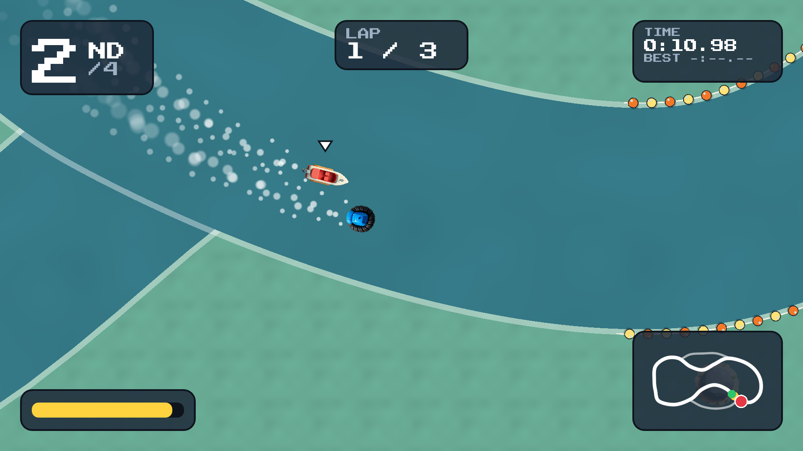

| Piece | What it is | File |
| --- | --- | --- |
| Boat | `class_name Boat extends Car`: the car's driver contract, surfaces, boost, levels and signals, with its own glide, bounce, bobbing, currents and jumps | [`actors/boat/boat.gd`](../actors/boat/boat.gd) |
| Boat scene | Same node layout as `car.tscn`, a capsule hull, a shadow for jumps | [`actors/boat/boat.tscn`](../actors/boat/boat.tscn) |
| Wake and sound | Foam V, churn, spray, splash ring; motor, wake, bump, whoosh and splash | [`boat_effects.gd`](../actors/boat/boat_effects.gd), [`boat_audio.gd`](../actors/boat/boat_audio.gd) |
| Roster | Nine `DriftSetup`s with `kind = &"boat"`, on `base_boat.tres` | [`game/configs/boats/`](../game/configs/boats/) |
| Courses | Spec, then points, then scene, exactly as for tracks (§7.2), with a water theme; `Track` measures branches and pushes currents | [`tools/layouts/tracks/boat_0N.json`](../tools/layouts/tracks/), [`track/track.gd`](../track/track.gd) |
| Logs | Floating logs drifting to and fro across the channel | [`actors/water/drifting_log.gd`](../actors/water/drifting_log.gd) |
| Look probe | The water at race scale, and the four water themes | [`tools/layouts/water_probe.py`](../tools/layouts/water_probe.py) |
| Checks | A boat is a Car; glide; banks and the hovercraft; currents; ramps; branch progress; the garage's two kinds; v3 saves; paints. Full races: `race_test -- --track=boat_0N --setup=<boat>` | [`tests/boat_test.gd`](../tests/boat_test.gd) |

### 20.1 How a boat handles

A boat uses the same velocity model as a car (§4). Different numbers make it feel like water.
These are the starting values, to be tuned in the balance pass:

| | Car | Boat | Why |
| --- | --- | --- | --- |
| `forward_drag` | 0.6 | 0.35 | Let go of the throttle and a boat glides on |
| `lateral_grip` | 9.0 | 4.0 | Turns carry the boat wide, like a long gentle drift |
| `engine_power` | 1400 | 1150 | Pulls away a little softer |
| `max_speed` | 1100 | 1050 | About the same, because the channel is wider |
| `wall_speed_scrub` | 0.15 | 0.08 | Shores, buoys and other boats **bounce** you off softly instead of stopping you |

- **Never a spin-out.** Steering still fades in with speed, as in §4. The minimum grip clamp
  (`MIN_LATERAL_GRIP`) still applies, so no boat can be made undrivable.
- **Bobbing.** The sprite rocks a few degrees and dips gently, faster at speed. This is purely
  visual; the collision shape never moves.

### 20.2 Water, banks, currents, ramps

A boat course is a race track whose **road is a channel of deep water** (§7.2). The theme
says so with `road_surface`. Everything off the channel is **shallows**, and the theme's patches
are **banks**:

| Surface | Speed | Grip | Where |
| --- | --- | --- | --- |
| deep water | 1.0 | 1.0 | the channel, the darker water with the pale lip |
| shallows | 0.6 | 0.8 | everywhere off the channel; each theme has its own colour, but all handle the same |
| bank (sand, mud, icing) | 0.35 | 0.6 | the theme's patches: islands, sandbanks, the shortcut on Pirate Cove |

- **Hovercraft** (`ignores_land`) skim the shallows and banks at full speed. That is their
  trick: on Pirate Cove they can take the sandbank shortcut.
- **Currents** are spans of the lap, given like ice spans (`current_spans`: start, length,
  strength). Inside one, every boat is pushed along the racing line at up to 260 px/s, which
  makes a river's straight feel fast. They are drawn as white chevrons on the water.
- **Ramps** are wooden wedges in the channel that reuse the boost-pad machinery. Hitting one
  gives a small boost and **airborne** for about 0.6 s:
  - the sprite grows by up to 25 % and a shadow drops below it;
  - boats in the air pass over other boats and ignore surfaces;
  - landing throws up a splash and a sound.

  Steering stays live in the air, so a jump never takes control away.
- **Fizz pads** on Lemonade Lake are boost pads (§7.3) in lemonade colours.
- **Obstacles are bumpers, never crashes.**
  - Buoys mark the tight bends, where cars have kerbs.
  - Rocks stand in the shallows.
  - Logs drift slowly to and fro across the channel along a short path.

  All of them bounce a boat away gently (`wall_speed_scrub` 0.08).
- **Bridges** over a river are scenery: drawn above the boats, with a shadow, never solid.
- The **shore** at the map edge is the wall (§7.2), lined with the theme's wall prop (reeds,
  palms, candy).

### 20.3 The courses

Four courses make the **Splash Cup**. The first boat cup is open from the start. Inside the
boat cups, the rule from §12 holds: the next cup opens when the previous one is **won**.

The courses are about **1.5× the size of the car tracks** (84×54 to 108×58 tiles, against
64×40), with a 4.5–5 tile channel. Every course has **two alternative paths**:

| Course | Map | Main channel | Alternative paths | Lap |
| --- | --- | --- | --- | --- |
| **Duck Pond** (pond: green shore, reeds, lily pads; sandbanks) | 84×54 | the easy one: a wide kidney loop round an island with a duck house, one ramp | **Reed Run**: a narrow reedy channel over the top instead of the dip (37 tiles for 40). **Duck Island**: round the far side of an islet on a gentle current (29 for 23) | ~28 s |
| **Jungle River** (river; mud banks) | 108×58 | two currents, drifting logs on the side, two bridges overhead | **Rapids**: a narrow fast-current run along the top, with two logs drifting across it (45 for 48). **Hidden Lagoon**: a calm wide loop below the middle hump (46 for 51) | ~38 s |
| **Pirate Cove** (lagoon; sandbanks) | 92×62 | a long winding cove, a ramp, and a sandbank shortcut across a hairpin (hovercraft only) | **Shipwreck Passage**: through the wreck island on a current, with a ramp in the middle (46 for 37). **Smuggler's Gap**: a tight gap between rocks that skips the top hairpin (14 for 38), the daring one | ~47 s |
| **Lemonade Lake** (lemonade; pink icing banks) | 96×60 | one ramp, three fizz pads, lemon slices and ice cubes | **Fizzy Falls**: across the top with two ramps, skipping the V (35 for 41). **Straw Slide**: along the right edge on a current (34 for 31) | ~35 s |

Lap times are estimates at the AI's average car speed. Races are 3 laps, apart from Pirate Cove
(2 laps, about 1½ minutes), so no race runs much over two minutes.

**How the alternative paths work.**
- A branch is in the course spec as `branches`: where it leaves and rejoins the racing line
  (`from_near` / `to_near`), its own control points, its width, and optionally a current and ramps.
- `track_layout.py` draws it, measures it against the stretch it bypasses, and keeps the finish
  and the checkpoint off any stretch a branch skips. It warns if a branch comes too close to
  the main channel.
- In the game, a boat on a branch has its progress mapped onto the bypassed stretch of lap, in
  proportion to how far along the branch it is. Laps, positions, the minimap, gates and
  rubber-banding need nothing new.
- AI boats choose a branch now and then, more often the higher their skill, so the child sees
  rivals take the other way. Smuggler's Gap is only for the most skilled AI.
- **Each path is a trade, not a free win:**
  - shorter paths are narrower, or have rocks and logs;
  - longer paths carry a current or a ramp;
  - Smuggler's Gap is the one real shortcut, threaded between rocks.

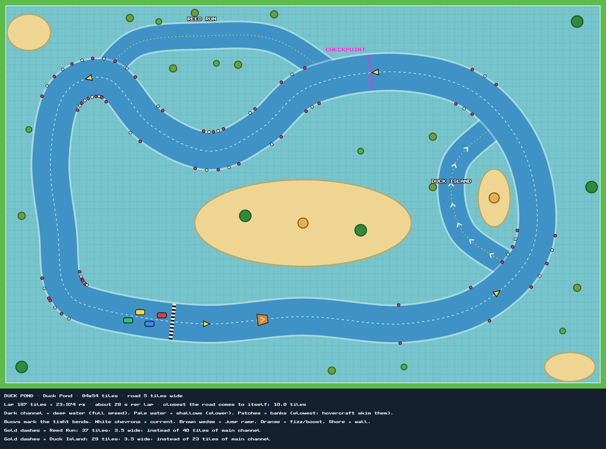
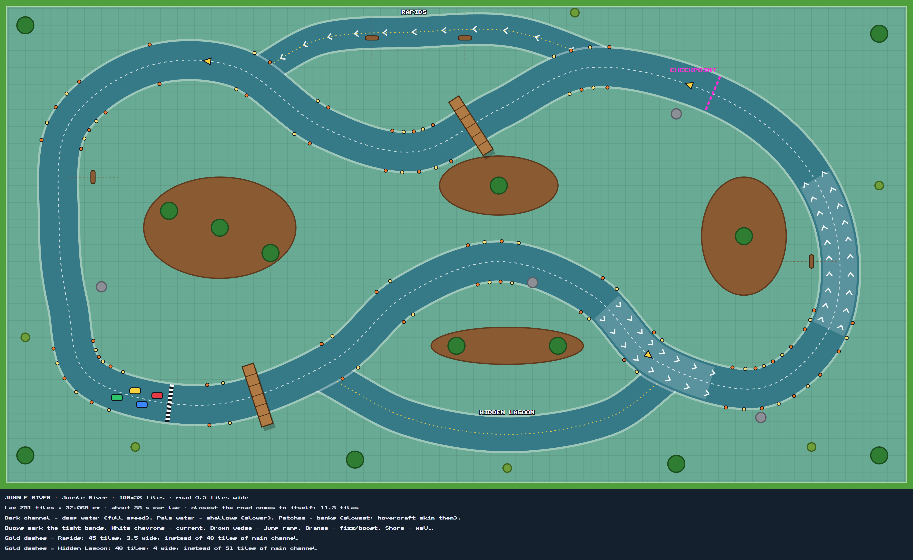
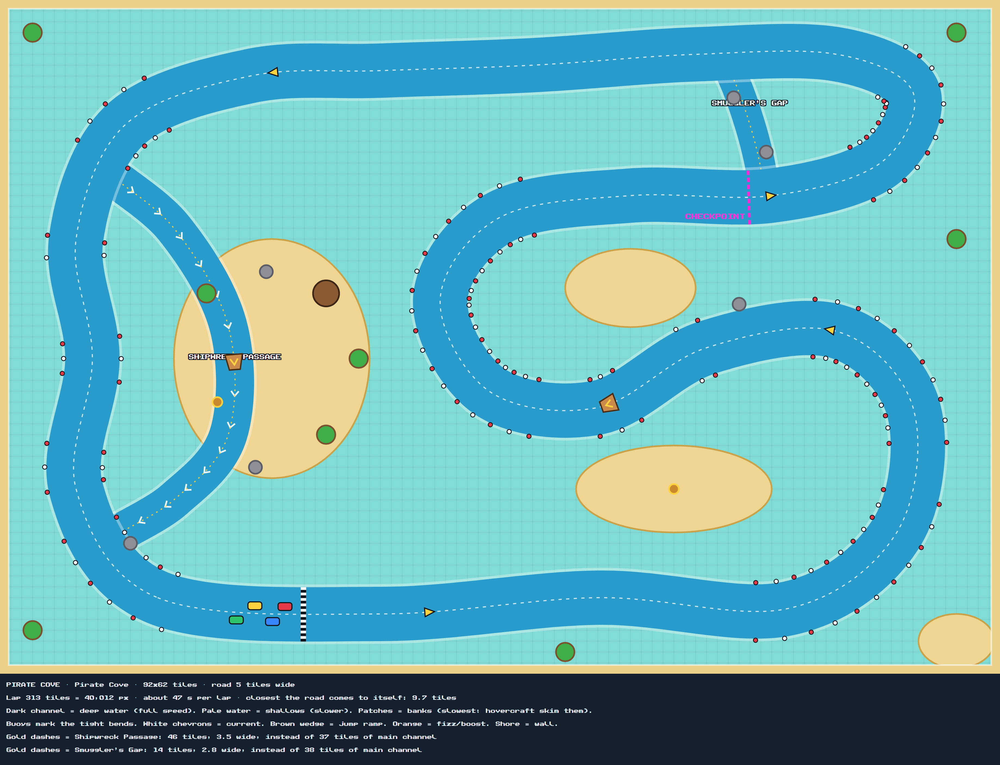
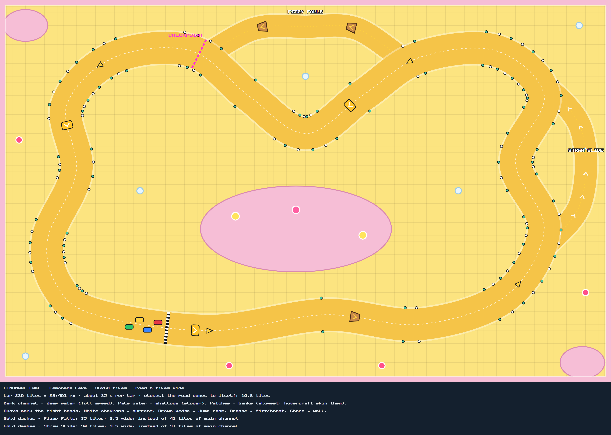

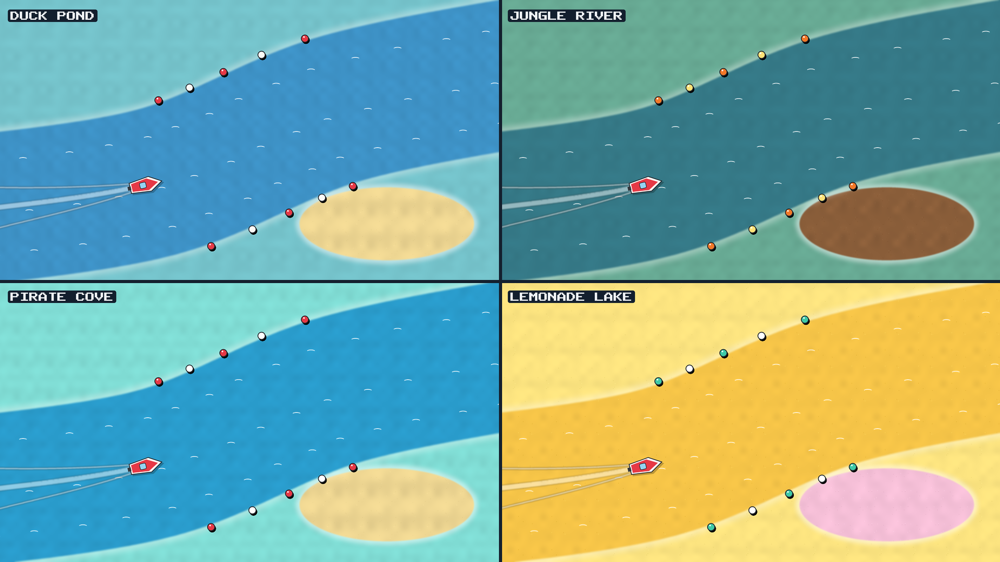

The water is made in the same way as every other ground (§7.5), as flat procedural fills in
`pipeline.json` `ground`: `pond_water`, `pond_deep`, `sandbank`, `river_water`, `river_deep`,
`lagoon_water`, `lagoon_deep`, `lemonade` and `lemonade_deep`. The water fills have no
speckles; speckles read as gravel on water. A theme with `"water": true` in `themes.json`
names its channel fill as `road`, and its kerb colours become the buoys.

### 20.4 The boats

The roster is nine boats (the bathtub was dropped). The bars in the dock are GRIP, **GLIDE** (in place of SLIDE)
and SPEED. Prices sit beside the cars' (100–1000):

| Boat | Kind | Character | Price |
| --- | --- | --- | --- |
| **Speedboat** | speedboat | the all-rounder, the starter boat | free |
| **Jet Ski** | jet ski | small and nimble, turns sharpest, light, bounces furthest | 100 |
| **Rubber Duck** | fun | grippy and steady, the easiest boat, quacks for a horn | 150 |
| **Swan Pedalo** | fun | slow to pull away, very grippy, honks | 250 |
| **Hovercraft** | hovercraft | slidey, full speed over shallows and banks | 300 |
| **Tugboat** | fun | heavy, pushes other boats aside, toots | 300 |
| **Pirate Ship** | fun | big and steady, fast on the straights, "boom" horn | 400 |
| **Banana Boat** | fun | long and fast, glides wide | 500 |
| **Paddle Steamer** | fun | the top boat: fastest, wheels churning, chuff-chuff | 600 |

Each boat is a FLUX sprite made with the frozen recipe (§11.1), 4 candidates and one pick.
Each gets six paint jobs as Kontext recolours, as in the paint shop (§9.3). Opponents pick from
the roster in the same way as car opponents (§8).

### 20.5 Screens

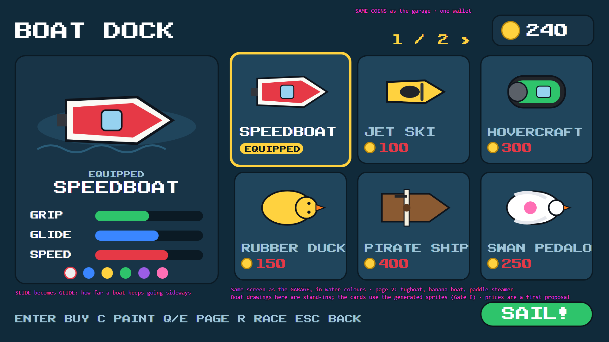

- **Title:** PLAY splits into two picture buttons, **CARS** and **BOATS**, so the menu keeps
  its height. CARS is focused first, as PLAY was. 2 PLAYERS asks "cars or boats" on the join
  screen. 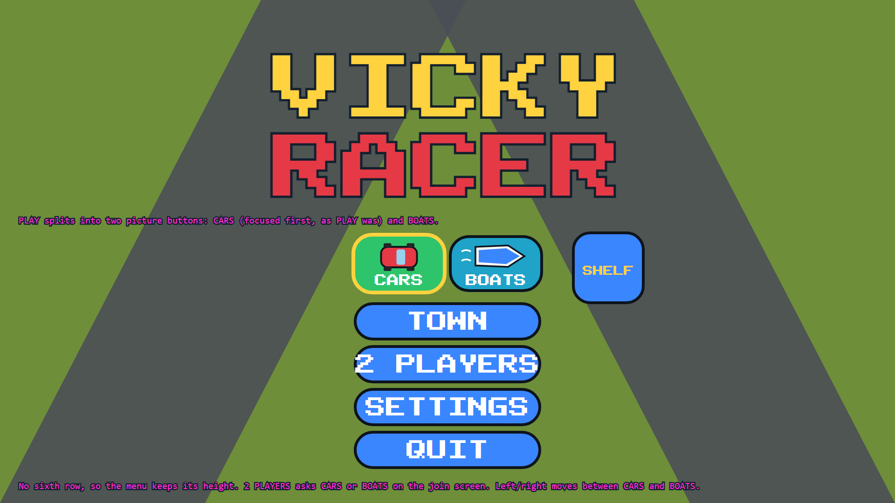
- **Pick a race:** the same screen. It shows the boat courses and boat cups when BOATS was
  chosen.
- **Boat Dock:** the garage screen (§9) in water colours, with the boat roster, GLIDE and SAIL!.
- **HUD, results, podium, pause:** unchanged.

### 20.6 Effects and sound

- **Wake:** a V of foam spreading behind every boat, plus a churned strip right behind the
  motor. It is longer at speed, and drawn on the water under the boats as the skid marks are.
- **Spray** comes off the outside of a turn when gliding wide. It replaces the drift smoke.
- **Splash** on landing a jump and on bumping a bank.
- **Sounds** use Stable Audio with the §11.2 recipe, picked from spectrograms:
  - motor loops for speedboat, jet ski and hovercraft, pitched by speed;
  - splash and ramp whoosh;
  - gentle wave ambience under the race;
  - horns for the fun boats.
- **Music:** two new pieces, river and lagoon. Duck Pond and Lemonade Lake reuse the meadow
  and candy pieces.

### 20.7 Under the hood

- `DriftSetup` gains `kind` (`car` / `boat`) and `ignores_land`. A boat's config is
  `base_boat.tres` with the setup's multipliers applied (`CarConfig.with_setup`).
- `TrackConfig` gains `vehicle_scene`. `RacerSpawner` spawns that scene, not a fixed car scene.
- `TrackTheme` gains `road_surface`. `Track.surface_at` reads it, and also reads
  `current_spans`, ramps and logs from the points JSON.
- `GarageManager` keeps owned, equipped and paint state per kind, with one coin balance.
- The save goes to schema 4 (`owned_boats`, `equipped_boat`, `boat_paint`) and migrates from 3.
- Because `Boat` **is a** `Car`, the race, HUD, minimap, ghosts, split screen and AI drive it
  unchanged.

### 20.8 What building it taught

- **A current moves the water, not the boat.** Pushing the boat along the current did little to a
  boat lying across it: its sideways grip ate the push. Grip and drag now work on the boat's
  motion *through the water* (velocity less the current), so any boat is carried along.
- **Progress on a branch is a blend.** Near its ends a branch runs beside the racing line, which
  measures a racer well; in the middle only the branch's own measure (in proportion to the
  stretch it skips) makes sense. The weight eases over 700 px of each end, the line's search is
  anchored at the nearer junction (Smuggler's Gap passes between two stretches of the line, and
  the search hopped between them), a racer keeps to a branch it is on except at its ends, and
  progress glides at most 60 px a frame. The race test's "progress never jumped" caught all of it.
- **The AI on a branch** follows the branch's line and lets go of it 120 px before its end; the
  first build held on past the end and circled the junction.
- Art lessons (Gate B): FLUX drew the tugboat, pirate ship and paddle steamer side-on; re-prompting
  with only what is seen from above fixed two; the pirate ship stayed three-quarter whatever was
  tried (Kontext from the speedboat, Kontext from a flat sketch), and the picked one is mirrored
  rather than turned, or it would sail upside down. The splash and the ramp take-off were cut
  from the approved wake and wave recordings (`derive_sfx.py`): Stable Audio's one-shot water
  sounded like wind.
- **The ramp is drawn from above** (redrawn in Phase 21). The first ramp was a three-quarter
  picture (a raised end on a block, seen at an angle). A ramp is turned to lie along the
  channel, and turned by 90–160° the three-quarter picture looked skewed or upside down. It is
  now a Kontext edit of a top-down sketch (`postprocess.ramp_sketch`, the buildings' trick):
  planks across, darker at the low end, a striped lip at the raised end and arrows pointing the
  way to go, so it reads at any angle. Seed 26 of eight; 25 and 26 kept the view, the rest
  went three-quarter again ([sheet](mockups/candidates/water_ramp.png),
  [every angle, before and after](mockups/candidates/water_ramp_angles.png)).

---

## 21. Free Drive: the island

*Built (Phase 21), through the three gates: mockups, then art, then code, all on 2026-10-06.*

The town (§19) becomes an island. The ring of trees at its edge gives way to grass with
palms, a sandy beach, and the ocean all round. A **harbour** on the south coast swaps the
car for the boat equipped in the Boat Dock (§20), so the child can sail round the island and
then drive back into town.

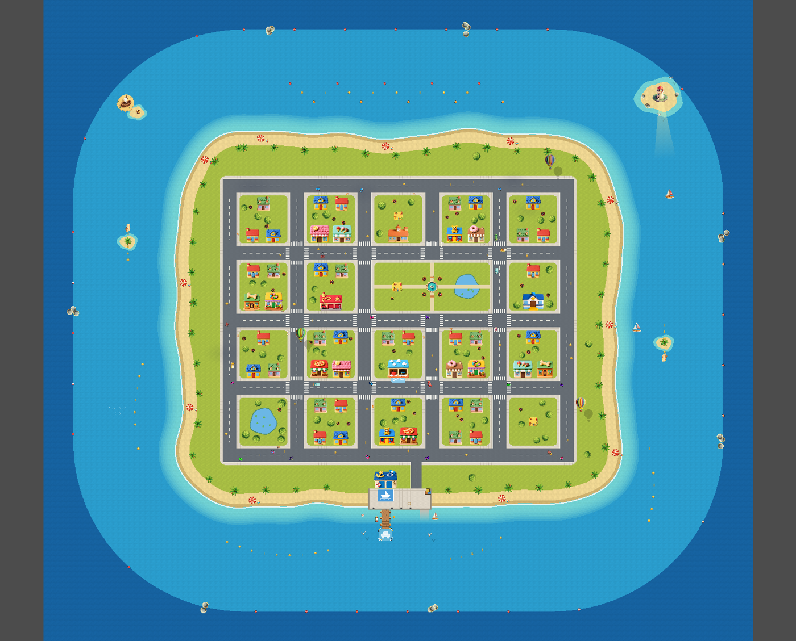

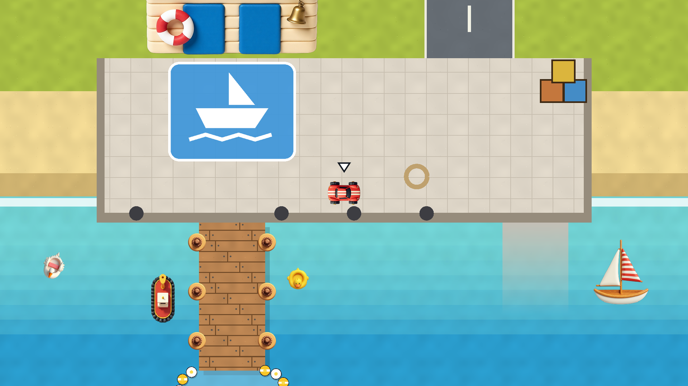

| Piece | What it is | File |
| --- | --- | --- |
| Island | The coast, the harbour and the sea, as data: `outline(d)` is the island's outline `d` px out from the waterline, so every band is the same line at another offset and none ever crosses another | [`town/island.gd`](../town/island.gd) |
| Town | Builds the coast, the harbour and the sea round the streets; says what each place's surface is | [`town/town.gd`](../town/town.gd) |
| Screen | The car and the boat, the swap, sea coins, the waves under the town's ambience | [`game/screens/town.gd`](../game/screens/town.gd) |
| Sea life | The sailboats, the dolphins, the gulls, the lighthouse's beam | [`actors/town/sea_life.gd`](../actors/town/sea_life.gd) |
| HUD | The fade, the boat beside the coins, a map with the coast (the whole sea while sailing) | [`ui/town/`](../ui/town/) |
| Checks | Coast surfaces, the waterline from both sides, both swaps, a sea coin, the ramp, a place at sea | [`tests/island_test.gd`](../tests/island_test.gd) |

The design was drawn first, as mockups:

| Picture | What it shows |
| --- | --- |
| [`01_island_overview.png`](mockups/island/01_island_overview.png) | The whole island from far out: the game's own photo of the town (`--overview`), with the coast, the sea and everything at sea painted round it |
| [`02_harbour_closeup.png`](mockups/island/02_harbour_closeup.png) | The harbour at game scale (zoom 1.0). The ring road is the game's own photo; the rest is painted in world pixels |
| [`03_swap_views.png`](mockups/island/03_swap_views.png) | What the screen shows at the land pad and at the mooring |

All three are drawn by [`tools/layouts/island_probe.py`](../tools/layouts/island_probe.py).
It photographs the running game and places every piece in world pixels. The positions in this
section are the ones the code will use.

### 21.1 The layout

The streets do not move. Only what lies outside the ring road changes.

| Band | Distance out from today's world edge | Surface |
| --- | --- | --- |
| Grass, with palms along its outer edge | up to about −70 px (inside the old edge) | grass |
| Beach: dry sand, then a strip of wet sand | −70 to +250 px, ± 150 px of gentle bays and points | beach sand (as on Sunny Beach: slow, never a trap) |
| Shallows: pale lagoon water, with a line of foam at the sand | +250 to about +670 px | shallows |
| The open sea | out to **+2,750 px** | deep water |
| The outer limit: red buoys and clumps of rock, with darker sea beyond | +2,750 px | a wall |

- The island has rounded corners (radius 1,300 px). The waterline wobbles along the coast,
  except at the harbour, where the quay wall is straight.
- The world grows from 9,920 × 8,320 to about **15,400 × 13,800 px**. `TownLayout.world_size()`
  stays the town's square of land (the sky's balloons stay over it); `Island.SEA` (2,750) gives
  the sea round it, and `Island.map_rect()` is the camera's limit.
- The beach has parasols and beach balls (Phase 20 art). Palms stand where the grass meets
  the sand, in place of the old ring of round trees.

### 21.2 The harbour

The harbour is on the south coast, between the third and fourth avenues (world x 4,250–5,750).
Its parts, from top to bottom:

| Piece | Where (world px) | What it is |
| --- | --- | --- |
| **Harbour road** | x 5,250–5,510, from the ring road to the quay | A short dead-end road with a lane each way. It is not on the traffic's map, so traffic never turns into it |
| **Harbour building** | 4,380–4,940 × 7,700–8,140, front facing down onto the quay | The harbour master's boathouse: a navy roof with a golden anchor, a coil of rope and a flag, cream boards, two big blue doors, a lifebuoy and a ship's bell. It is a named place (`HARBOUR`) like the shops, so its sign pops up |
| **Quay** | 4,250–5,750 × 8,150–8,650 | Stone paving with a dark edge and bollards along the water; crates (solid) in the far corner and a coil of rope |
| **Land pad** | 4,470–4,850 × 8,165–8,460 | A blue pad with a white boat on it, in front of the building's doors |
| **Pier** | 4,560–4,760, out to y 9,100 | Wooden planks, with posts down both sides. It is solid for boats; cars cannot reach it, because the quay edge is a wall |
| **Mooring** | 4,500–4,820 × 9,100–9,380, at the end of the pier | Water inside a ring of floating white and yellow buoys, with a car drawn on the water |
| **Slipway** | 5,480–5,680, down into the water | Scenery: concrete running into the sea |
| **Boats tied up** | beside the pier and the quay | The tugboat, the rubber duck, the swan and a sailboat, as props |

### 21.3 Swapping

Each pad shows what you will become, not what you are: the land pad has a **boat** on it,
and the mooring has a **car**.

1. The player's car drives onto the land pad. Steering in is needed, as at the car wash. The
   car must be going slower than 300 px/s, so a child racing across the quay is not swapped
   by accident.
2. The ship's bell rings and the screen fades to white for 0.35 s.
3. The car is left parked on the pad as a prop, in its paint.
4. The equipped boat appears in the mooring, in its paint, pointing out to sea (down the
   screen). The camera follows it, and the fade lifts.
5. Sailing back into the mooring does the same in reverse. The boat is left tied up in the
   mooring, and the car appears on the land pad, facing up the harbour road.

A pad that was just used does nothing until the vehicle has left it, so nobody swaps
straight back. While sailing, the HUD shows a little boat, and the pause menu's GARAGE opens
the Boat Dock.

### 21.4 Who can go where

The coast has **two edges on the same waterline**:

- a sea edge, which stops cars at the wet sand;
- a land edge, which stops boats in the shallows.

So cars can drive on the beach, and boats can sail right up to it. The quay and the pier are
walls for boats. The town's pond stays car water, as it is now; a boat can never reach it.

### 21.5 Things to do at sea

| Thing | Where | What happens |
| --- | --- | --- |
| **Coin trails** | Arcs of 7–9 coins round the coast, through the slalom and over the ramps | Each coin is worth 2. It is banked at once and comes back 40 s later, as in town |
| **Lighthouse** | On a rocky islet off the north-east corner | Its beam sweeps slowly round. Sailing within 700 px of it counts as a place (`LIGHTHOUSE`) |
| **Two ramp islets** | East and west | A ramp in the water in front of a sandy islet with a palm. Jump the islet and collect the coins in the air (Phase 20's ramp and airborne) |
| **Buoy slalom** | Along the north shore | Ten buoys, alternately left and right, with a coin in each gate |
| **Shipwreck** | Off the north-west corner | The Phase 20 wreck on a sandbar, with a treasure chest. Sailing within 700 px of it counts as a place (`SHIPWRECK`) |
| **Dolphins** | West | A pod of three. When a boat comes within 1,100 px they swim along beside it (up to 2,600 px from home), each leaping in an arc every 1–2.4 s, with a splash and, near the player, a whistle |
| **Seagulls** | Two over the harbour, two over the lighthouse | They circle, flapping. A horn within 520 px sends one off crying; it fades back in over its spot 9 s later |
| **Two sailboats** | One loops round the whole island, 2,100 px out (past every islet, ramp and coin trail), the other round the lighthouse | They follow fixed loops at a gentle speed. They are bumpers: a boat that meets one bounces off softly |

The places at sea count towards the all-places bonus, which grows from 11 to 14 places (the
harbour, the lighthouse and the shipwreck).

### 21.6 Art and sound (Gate B)

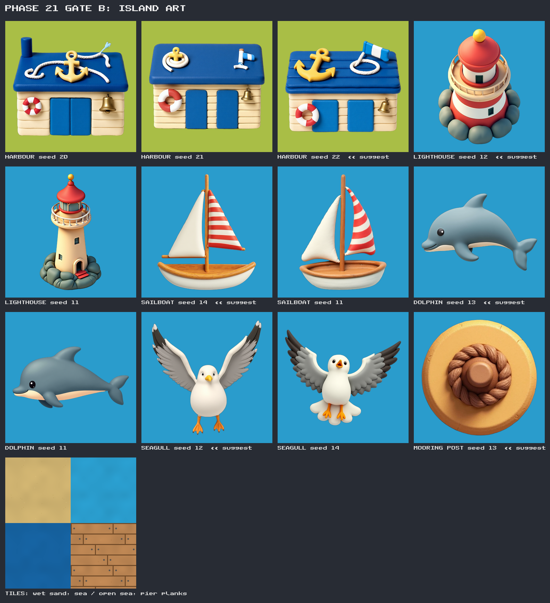

| Art | Pick | Note |
| --- | --- | --- |
| Harbour building | 22 | A Kontext edit of the block sketch ([`harbour_sketch.png`](mockups/island/harbour_sketch.png)), as for every building (§19.2). Round 1 asked for a round lookout tower on the roof, and all four came out at an angle. Round 2 asked only for things lying on the roof (an anchor, a coil of rope, a flag), as the fire station did, and seeds 20–22 kept the street view |
| Lighthouse | 13 | Red-roofed, on a grassy rock with steps |
| Sailboat | 14 | Red-striped and white sails |
| Dolphin | 13 | Mid-leap |
| Seagull | 12 | Wings up, dark tips |
| Mooring post | 13 | A coil of rope round a wooden top, seen from above |

- **Side-on, like the balloon.** FLUX drew the lighthouse, sailboat and dolphin from the side,
  and the gull from the front, however they were asked for. They are kept that way, as a
  picture-book map draws them (the building fronts and the hot-air balloon already are). In
  the game they are **never rotated**: a sailboat or a dolphin is mirrored to face the way it
  goes, a dolphin tilts along its leap, and a gull hovers and flaps.
- **Ground:** wet sand, sea and open sea are flat fills in `pipeline.json` (`wet_sand`,
  `lagoon_deep`, `open_sea`), built to `art/town/island/`. The pier's planks are drawn in
  [`town_art.py`](../tools/layouts/town_art.py).
- **Reused as they are (Phase 20 art):** rocks, ramps, palms, parasols, beach balls, the
  shipwreck and the treasure chest.
- **Sound** (Stable Audio, the §11.2 recipe; Claude's picks, from the spectrograms, at the
  user's word): **harbour_swap** 106, three quick dings of a harbour bell; **seagull** 107,
  one clear cry; **dolphin** 105, whistles and clicks. The listening page is made by
  `tools/comfy/listen_island.py`. The sea uses Phase 20's wave ambience, mixed in while
  sailing.

### 21.7 Under the hood (Gate C)

- **`Island`** holds every position. The mockup script has its own copy of the numbers it was
  approved with; since then the lighthouse and the wreck have moved about 600 px nearer the
  island, so the big sailboat loop could pass outside them (the first loop, 1,250 px out, ran
  straight through the east ramp islet).
  The outline is a rounded rectangle round the town's world rect, 80 px a point, with the
  waterline wobbling by three sine waves along it; the wobble fades out towards the harbour.
- **`town.gd`:**
  - `_build_edge` (a wall hidden in a ring of trees) is gone. `_build_coast_ground` draws open
    sea, sea, seven faint bands of shallows (so they pale smoothly towards the sand), foam,
    wet sand, beach and grass as large textured polygons; `_build_coast`, `_build_harbour`
    and `_build_sea` place everything on them.
  - `surface_at` checks the streets first, as before, so traffic pays nothing for the coast.
    Outside them: the quay and the harbour road are asphalt, then grass, beach, an islet
    (sandbank), the shallows (lagoon water) and deep water, by point-in-polygon on the bands.
- **Who can go where:** `Car` gets `LAYER_SEA_EDGE` (32) and `LAYER_LAND_EDGE` (64), and
  `_edge_layer()`, which a `Boat` overrides. The shore is one closed line of segments on
  both layers, with the quay standing out into the water; the pier and the islets (solid
  polygons, so a boat landing a short jump on one is pushed off it) are land edge only; the
  outer limit, the slalom buoys, the moored boats and the sailboats are world walls. A boat in
  the air only touches the world, so the ramp throws it clean over its islet.
- **The swap** (`game/screens/town.gd`): the player's car and boat both live in the screen;
  `player` is whichever is being driven. Each physics frame the screen checks whether the
  player is on their pad (`Island.LAND_PAD` for the car, `Island.MOORING` for the boat), slow
  enough, and the pad is armed (it re-arms once the vehicle is 60 px clear of it). `_park`
  takes the controls, camera and marker off one vehicle and freezes it with its sound off;
  `_drive` gives the other new ones. The new chase camera takes over the view by itself
  (§19.6), so no camera is moved. The boat is made at the first swap, from the state's
  `equipped_boat` and its paint. The swap also tells the garage which kind is on show, so
  the pause menu's GARAGE opens the Boat Dock while sailing.
- **Sea coins** lie at fixed spots (`Island.sea_coins()`) and come back where they were; they
  also see a boat in the air, so the ones over the ramp islets are picked up mid-jump.
- **What stays in town:** the sky, the traffic and the walkers. Sea life follows fixed loops
  and simple rules (`SeaLife`), not traffic AI.
- **Dev flags:** `--start=harbour` (on the quay beside the land pad), `--start=sea` (sailing,
  at the mooring); `--overview` now frames the whole sea.
- **Checks:** [`tests/island_test.gd`](../tests/island_test.gd), and the whole suite.
  `town_test` passes unchanged (14 kinds of place now, and the harbour stands on no lawn).

## 22. Drivers

*Built through the three gates: mockups (approved 2026-10-06), then art, then code, finished 2026-10-07.*

Every car and boat gets a visible driver, so the child can see **Vicky** at the wheel and
tell the other racers apart by who is driving. A driver is a separate sprite on top of the
vehicle, not painted into it. That way one driver works with all six paints, and the same car can
carry Vicky in one race and an opponent in the next.

### 22.1 Who drives

The driver follows the racer's colour, which the HUD, the names and the 2P markers already use.

| Racer | Driver | Colour |
| --- | --- | --- |
| Player 1, Free Drive, the title car, time-trial ghosts (shown only in open and glass vehicles) | Vicky (he/him), blond | red `#E63946` |
| Player 2 | a friend | purple `#9E59F2` |
| BLUE, YELLOW, GREEN opponents | three different kids | their racer colour |
| Town traffic | grown-ups: a bus driver, a firefighter, a bin collector | |

- **In cars**, each kid wears a racing helmet in their colour with their own decal.
- **On boats**, each kid wears a sun cap in their colour and an orange life vest.
- **The art:** 5 kids × 2 outfits + 3 grown-ups = 13 small top-down head-and-shoulders
  sprites, about 30 px across in a 128×72 body, facing +X like the bodies.

### 22.2 Seats

A vehicle that shows its driver has one seat. All its paints share it, because a paint is a recolour of the same picture.

- **Open seats:** the driver is drawn straight on top of the vehicle. These are the speedboat,
  jet ski, duck, swan, banana boat, pirate deck and tugboat deck, the kart, the
  formula and the soapbox.
- **Baked drivers:** the kart and formula already have a driver painted in. Their race bodies
  and paints are edited to show an empty seat; their garage cards keep the painted driver.
- **Glass:** the bubble car's dome, and the windscreens of the bus, the fire engine and the garbage truck. The driver is
  clipped to the glass, and a tint and a sheen are laid over the driver.
- **Closed roofs show no driver:** the starter, grippy, ice cream, slider, rocket, monster,
  police, banana and dragon, the hovercraft and steamer, and the delivery van (whose windscreen
  is its face). The mockup's option A, a pop-up sunroof, was built and tried in the game. The user
  turned it down on 2026-10-07 because the drivers looked as if they sat on top of the vehicle, not
  inside it. So these vehicles have no seat, and their driver stays hidden under the roof.

The driver leans a few pixels into a turn. On a boat it bobs and jumps with the hull, because it
is a child of the body sprite.

The mockup is [`driver_mockup.png`](mockups/drivers/driver_mockup.png), with a game-size strip in
[`driver_mockup_1x.png`](mockups/drivers/driver_mockup_1x.png). Both are drawn by
[`tools/layouts/driver_mockup.py`](../tools/layouts/driver_mockup.py) with rough placeholder heads
on the real sprites.

### 22.3 Built

| Piece | What it is | File |
| --- | --- | --- |
| Seats | The seat of each vehicle that shows its driver: where, open or glass. All paints share one entry | [`game/configs/driver_seats.gd`](../game/configs/driver_seats.gd) |
| Look | Driver ids (`vicky`, `p2`, `blue`, `yellow`, `green`, the four grown-ups) and their pictures | [`game/configs/driver_look.gd`](../game/configs/driver_look.gd) |
| Rider | Draws the driver as a child of the body sprite: the glass, and the lean | [`actors/car/driver_rider.gd`](../actors/car/driver_rider.gd) |
| Car | `driver_id`; the rider is rebuilt when the body or driver changes | [`actors/car/car.gd`](../actors/car/car.gd) |
| Checks | Seats (and none for closed roofs), pictures for every driver, glass, repaint, boats, 1P and 2P races | [`tests/driver_test.gd`](../tests/driver_test.gd) |

Who sets `driver_id`:
- `RacerSpawner`: player 1 is Vicky and player 2 the friend; opponents go by their slot (BLUE, YELLOW, GREEN).
- The title screen's race.
- Free Drive: Vicky in the car and the boat. The trucks get their grown-up and the little cars get random kids.
- `GhostCar`: Vicky, see-through.

The art:
- **How it is made:** each driver is a Kontext edit of a flat sketch (`postprocess.driver_sketch`, using
  the pipeline.json `drivers` instruction), picked from 8 seeds each. The sheets are
  `docs/mockups/candidates/driver_*.png`.
- **Why sketches:** FLUX on its own drew the figures from the front. Kontext sometimes turns the
  figure round, so a pick that came out facing down has `"facing": "down"`.
- **Kart and Formula:** their race bodies and paints are Kontext edits with the seat emptied (the
  manifest's `paints.empty_seat`); their cards keep the painted driver.
- **Checking seats:** the seat sheet [`driver_sheet.png`](mockups/drivers/driver_sheet.png) is drawn by
  [`tools/layouts/driver_sheet.py`](../tools/layouts/driver_sheet.py) the way the rider draws, for
  tuning seats without running the game.

---

## 23. Space: racing among the stars

*Built (Phase 22): Gate A 19dda09, Gate B 9e0e082 and a18c416, Gate C 39d198c, all 2026-10-07/08.*

**SPACE** on the title screen is a third racing game beside the cars and the boats. It has its
own spaceships in its own **Hangar**, four space courses and the **Comet Cup**, and works with
2 PLAYERS and time trial. As with the boats, coins are shared and the shelf collects stickers
from all three.

What makes space feel different (the user's choice, 2026-10-07):
- **Floaty drift.** Ships slide further than boats.
- **Asteroids and comets.** Drifting asteroids are soft bumpers. Comets streak across the lane
  now and then.

There is no planet gravity and there are no warp rings: those were offered and left out.

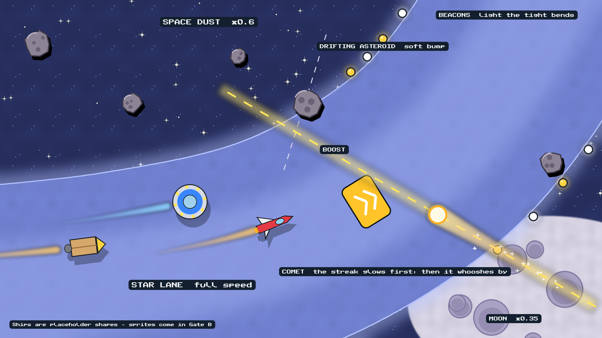

| Piece | What it is | File |
| --- | --- | --- |
| Courses | Spec, then points, then scene, exactly as for tracks (§7.2) and boat courses (§20.3), with a space theme | [`tools/layouts/tracks/space_0N.json`](../tools/layouts/tracks/) |
| Layouts | `track_layout.py` draws a space theme as stars, an asteroid-ring wall and a glowing lane, and writes asteroids, comets and tunnels into the points JSON | [`tools/layouts/track_layout.py`](../tools/layouts/track_layout.py) |
| Themes | `moonbelt`, `rings`, `nebula`, `candy_galaxy` with `"space": true`; their fills in `pipeline.json` `ground` (stars are speckles that are always brighter, `speckle_sign` 1) | [`tools/layouts/themes.json`](../tools/layouts/themes.json) |
| Look probe | The lane at race scale, and the four space themes | [`tools/layouts/space_probe.py`](../tools/layouts/space_probe.py) |
| Screens | The Hangar and the title with SPACE | [`docs/mockups/space/`](mockups/space/) |

### 23.1 How a ship flies

A ship uses the same velocity model as a car (§4) and a boat (§20.1). Different numbers make it
float. These are the starting values, to be tuned in the balance pass:

| | Car | Boat | Ship | Why |
| --- | --- | --- | --- | --- |
| `forward_drag` | 0.6 | 0.35 | 0.25 | Let go and a ship coasts on and on |
| `lateral_grip` | 9.0 | 4.0 | 3.3 | Turns carry a ship wide: the longest, softest drift in the game |
| `handbrake_lateral_grip` | 1.8 | 1.4 | 1.2 | A handbrake turn swings the tail round slowly |
| `engine_power` | 1400 | 1150 | 1200 | |
| `max_speed` | 1100 | 1050 | 1100 | The lane is the widest of the three (5.5 tiles) |
| `wall_speed_scrub` | 0.15 | 0.08 | 0.08 | Asteroids, the edge and other ships bounce you off softly |

- **Never a spin-out.** Steering fades in with speed and `MIN_LATERAL_GRIP` (3.0) still holds.
  The base grip sits just above it, so the slidiest ships all end up near the floor. They are
  told apart by drag and power instead.
- **Floating.** The sprite hovers: it sways a little and its shadow sits further below it than
  a car's, so the ship reads as off the ground. The collision shape never moves.
- **Exhaust.** A fading glow ribbon trails from the engine, longer at speed. When the ship slides
  wide, stardust puffs replace the drift smoke and the boat's spray.

### 23.2 The lane, dust, clouds, asteroids and comets

A space course is a race track whose **road is a glowing star lane** (§7.2). As on water
(§20.2), the theme names the surfaces:

| Surface | Speed | Grip | Where |
| --- | --- | --- | --- |
| star lane | 1.0 | 1.0 | the lane, a soft glowing path with a bright rim |
| space dust | 0.6 | 0.8 | everywhere off the lane, starry; each theme has its own colour, all handle the same |
| cloud | 0.35 | 0.6 | the theme's patches: the moon's surface, ring dust, nebula clouds, cotton candy |
| ice | (§7.3) | | Ring Road's icy stretches of ring, the existing ice surface |

- **Beacons** light the tight bends, where cars have kerbs and boats have buoys.
- **The wall** at the map edge is a ring of big asteroids, as the shore is on water.
- **Asteroids are bumpers, never crashes.**
  - Some float still in the dust as scenery that bounces you off.
  - Others drift slowly to and fro across the lane on a short path. These are the boats'
    floating logs (`drifting_log.gd`) with a rock in place of the log.
- **Comets** cross the course on a fixed path, every 7–10 s (`comets` in the spec: path, period,
  offset). They are made to be fair to a small child:
  1. 1.5 s before a comet comes, its path glows on the lane as a dashed yellow streak, and a
     soft rising chime plays.
  2. The comet whooshes along the streak with a sparkly tail and is gone in under a second.
  3. A ship it touches gets a sideways nudge (about 300 px/s) and a shower of sparkles. It never
     stops the ship, never spins it and never takes control away.
  4. A comet's period starts with the race (`offset`), so the same comet comes at the same moment
     every lap. A child can learn it.
- **Station tunnels** on Nebula Station are scenery, as the bridges over a river are: drawn
  above the ships, with a shadow, never solid.
- **Boost pads** (§7.3) are the same as on the road, two or three per course.
- **The sky** is the base fill with small stars, plus one parallax layer of bigger twinkling
  stars that drifts slower than the ground, so space has depth. The probe draws that layer.

### 23.3 The courses

Four courses make the **Comet Cup**. The first space cup is open from the start. Inside the
space cups the rule from §12 holds: the next cup opens when the previous one is **won**.

The courses are the size of the boat courses (88×56 to 104×58 tiles) with a 5.5-tile lane. As on
water, every course has **two alternative paths** (`branches`, §20.3). The progress mapping, the
AI's choice by skill and "a trade, not a free win" all carry over unchanged.

| Course | Theme | Map | Main lane | Alternative paths | Lap |
| --- | --- | --- | --- | --- | --- |
| **Asteroid Alley** | moonbelt: navy space, the moon, moon base, grey asteroids | 88×56 | the easy one: a wide loop round the moon, one comet, two boosts | **Rock Garden**: narrow, along the top through the belt, two asteroids drifting across it (40 tiles for 45). **Crater Cut**: narrow, across the corner by a little crater, near where the comet ends (28 for 39) | ~31 s |
| **Ring Road** | rings: teal space, a huge ringed planet in the middle | 104×58 | rides the planet's ring: two icy stretches, two comets | **Inner Ring**: a little longer, round the inside, and misses the icy wiggle (53 for 48). **Moon Loop**: round a little moon, a little longer, and misses a comet (46 for 41) | ~34 s |
| **Nebula Station** | nebula: purple space, pink clouds, a space station | 96×62 | a long winding course through two station tunnels, two comets | **Docking Gap**: a tight 3-tile gap past the station with an asteroid drifting across it, the daring one (29 for 74). **Cloud Hop**: a calm lane through the nebula (42 for 38) | ~52 s |
| **Candy Galaxy** | candy_galaxy: plum space, a lollipop planet, gumballs, cotton candy | 96×60 | three boosts, two comets | **Gumball Gap**: 2.8 tiles wide, two gumballs drifting across it (25 for 31). **Sugar Rush**: along the right edge, missing the wiggle (28 for 30) | ~37 s |

Lap times are estimates at the AI's average speed. Races are 3 laps, apart from Nebula Station
(2 laps, about 1¾ minutes).

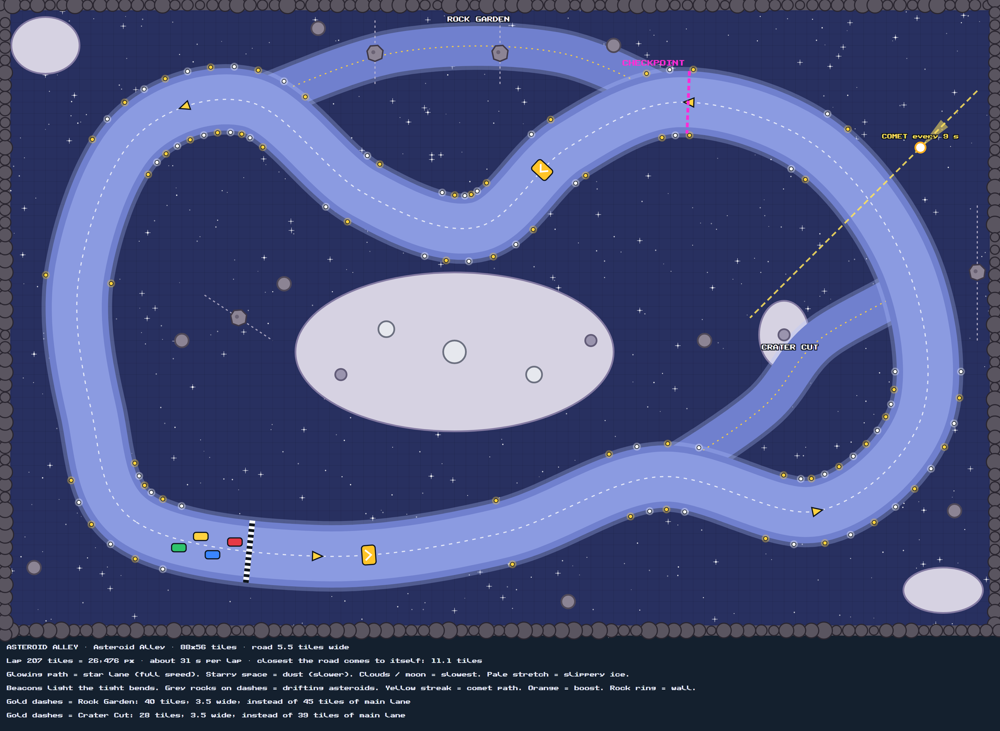
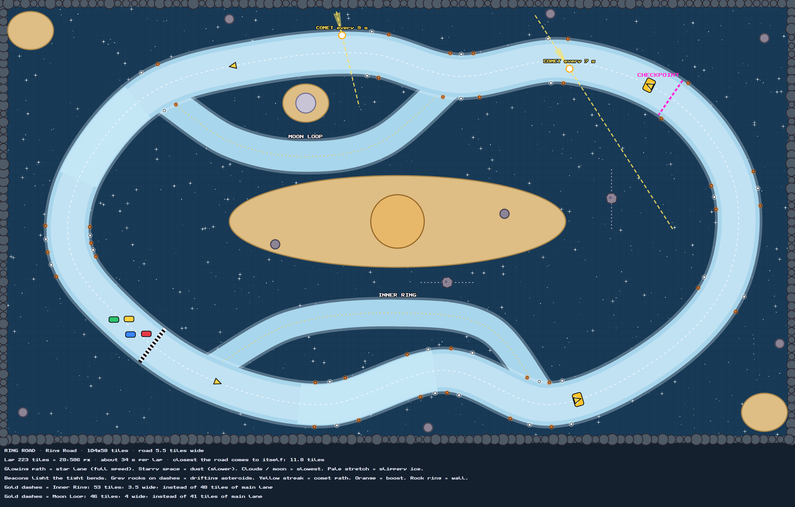
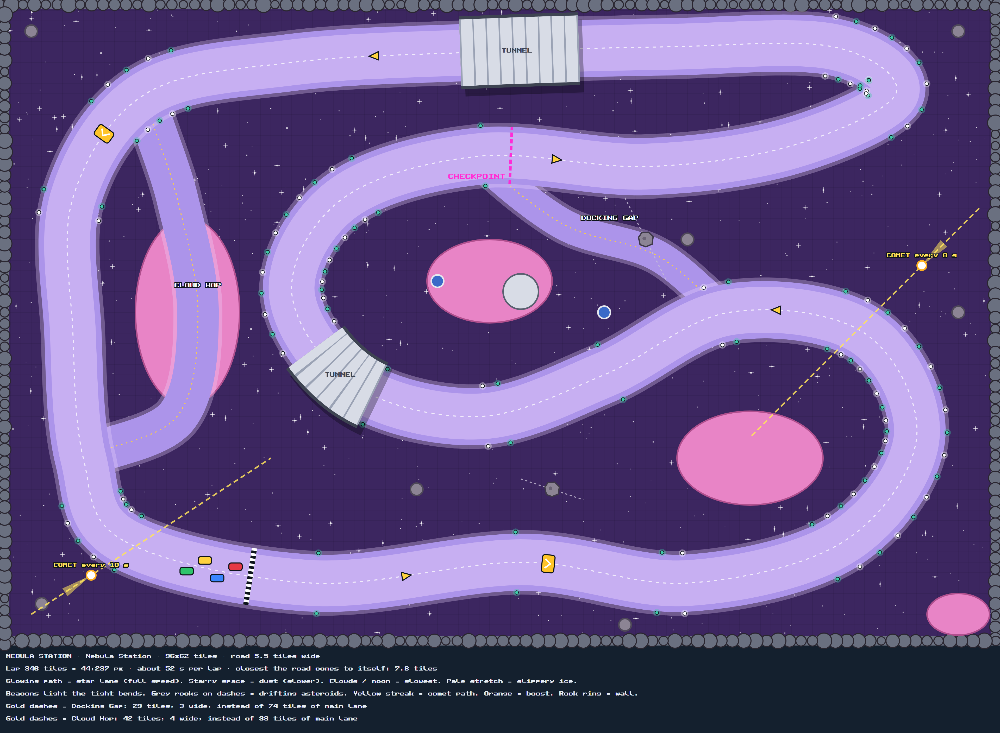
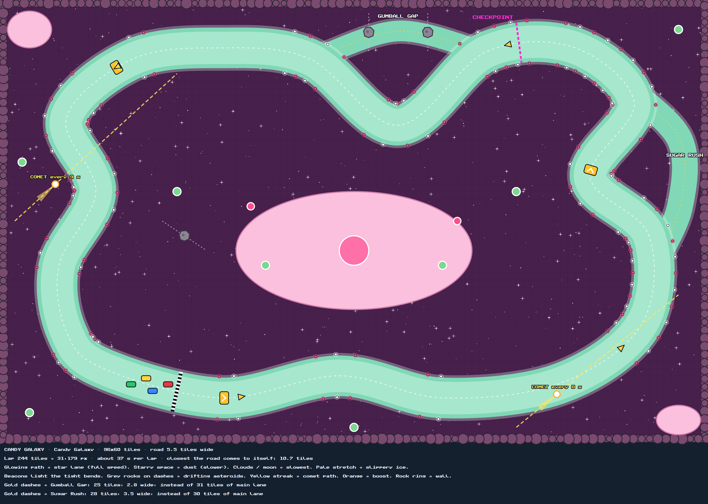

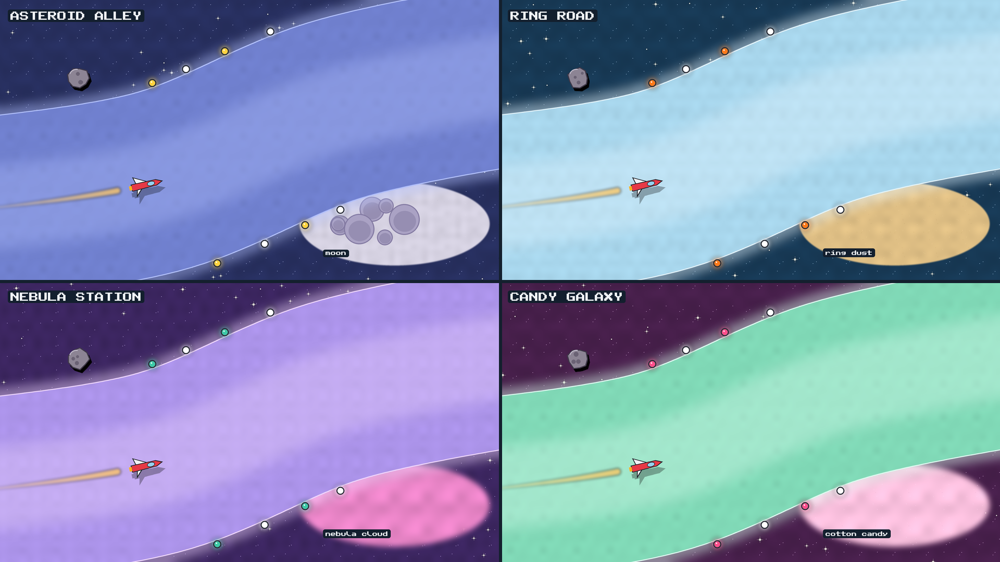

Asteroid Alley is not Moon Base (§7.1, track 7). Moon Base is a car track on the moon's dust.
Asteroid Alley is flown in space past the moon, and the moon is a slow cloud in its middle.

### 23.4 The ships

There are nine ships, saucers and fighters plus fun ships (the user's choice). The bars in the
Hangar are GRIP, **FLOAT** (in place of SLIDE) and SPEED. Prices sit beside the boats'
(a first proposal):

| Ship | Kind | Character | Pilot | Price |
| --- | --- | --- | --- | --- |
| **Star Fighter** | fighter | the all-rounder, the starter ship | in the cockpit bubble | free |
| **Racing Pod** | fighter | small and nimble, turns sharpest, light, bounces furthest | under the canopy | 100 |
| **Flying Saucer** | saucer | grippy and steady, the easiest ship; lights round the rim | in the dome | 150 |
| **Cardboard Rocket** | fun | a homemade box rocket, slow to pull away, grippy | in the open box | 200 |
| **Space Taxi** | fun | yellow and chequered, steady, "beep beep" | under the bubble roof | 250 |
| **Star Glider** | fun | a five-pointed star with a bubble cockpit, the slidiest, floats wide | in the bubble | 300 |
| **Teacup Saucer** | fun | a flying teacup, very grippy, slow; clinks | in the cup | 350 |
| **Star Freighter** | fun | a big cargo ship stacked with containers, heavy, pushes other ships aside, fast on the straights; a deep toot | none (closed) | 450 |
| **Comet Racer** | fighter | the top ship: fastest, a long tail of sparks | in the cockpit | 600 |

- **Sprites:** each ship is made with the frozen recipe (§11.1), 4 candidates and one pick, and
  gets six paint jobs as Kontext recolours (§9.3). The boats taught us that FLUX draws some
  things side-on (§20.8), so any ship that comes out side-on gets the Kontext-from-a-flat-sketch
  treatment straight away.
- **Pilots are part of the ship picture**, not the §22 driver layer. A little astronaut in a
  clear bubble helmet sits in each cockpit, one per ship, made as a Kontext edit of the empty
  ship (`ship_*_pilot`). Its suit is the ship's colour, so the paint jobs recolour it too. The
  closed Star Freighter shows none. The empty ships are kept in `art/ships/empty/`.
- **Opponents** pick from the roster as car and boat opponents do (§8).
- **Three swaps at Gate B (2026-10-08).** The Rocket Armchair and the Space Whale were drawn,
  and the user dropped both: they "do not fit in space". The Star Surfer and the Star Freighter
  took their places, at the same prices and with the same handling. Then the Star Surfer went
  too: no try put a pilot on its open board convincingly, so the **Star Glider** (a star with a
  bubble cockpit) took its place.

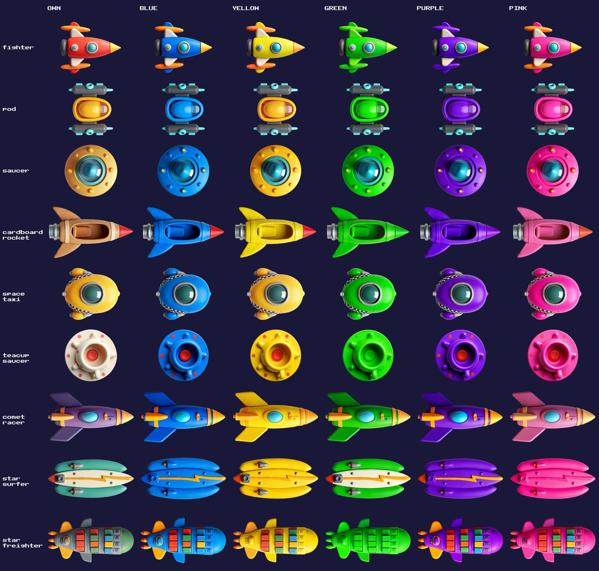

### 23.5 Screens

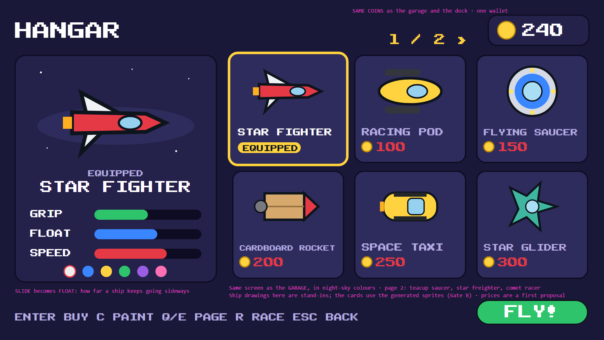

- **Title:** the picture row gets a third button: **CARS · BOATS · SPACE**. SPACE is a starry
  purple tile with a rocket. The row grows wider, not taller, and left/right moves along it.
  CARS is still focused first. 2 PLAYERS cycles CARS / BOATS / SPACE on the join screen.
  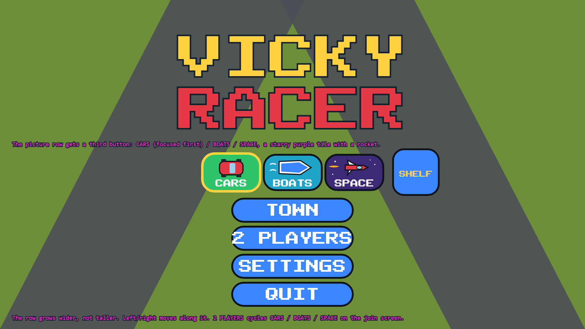
- **Pick a race:** the same screen. It shows the space courses and space cups when SPACE was
  chosen.
- **Hangar:** the garage screen (§9) in night-sky colours, with the ship roster, FLOAT and FLY!.
- **HUD, results, podium, pause:** unchanged.

### 23.6 Art, sound and music (Gate B)

*Done 2026-10-08. The user picked every seed; the sounds and music by ear on the listening
page (https://claude.ai/artifact/TV2K4Q8xXwKwUmuHm35aNV, built by `tools/comfy/listen_space.py`).*

| Piece | What was made | Where |
| --- | --- | --- |
| Ships | 9 sprites (FLUX, frozen recipe), each with its pilot baked in (a Kontext edit), Hangar cards, 6 paints each (Kontext recolours of the piloted ship; the yellow pod and taxi are their own yellow) | `art/ships/`, `art/ships/empty/`, `art/ships/paint/`, `art/ui/cards/ships/` |
| Drivers | Vicky, P2 and the three kids in a bubble space helmet (`driver_sketch` with `hat_kind` `space`). Made first, then not used: laid over the ships they looked stuck on top, so the pilots were baked in | `art/drivers/space/` |
| Ground | The four themes' dust and cloud atlases and TileSets, the star lane, and a beacon strip in place of kerbs (`theme_art.beacon_strip`) | `art/tiles/space/`, `track/themes/ground_*.tres` |
| Props | ringed planet, lollipop planet, space station and its tunnel, moon base, little moon, asteroid, gumball, solar panel, comet | `art/props/space/` |
| Icons | the Comet Cup; stickers First Flight and Comet Cup, plus the boats' First Splash and Splash Cup | `art/ui/cups/`, `art/ui/stickers/` |
| Sounds | thruster, saucer and rocket loops; space ambience; comet chime and whoosh; asteroid bonk; horns for the ships, the taxi, the freighter and the teacup | `art/sfx/` |
| Music | `race_rings` (Ring Road) and `race_nebula` (Nebula Station) | `art/music/` |

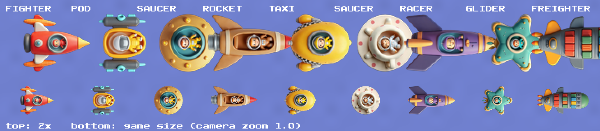
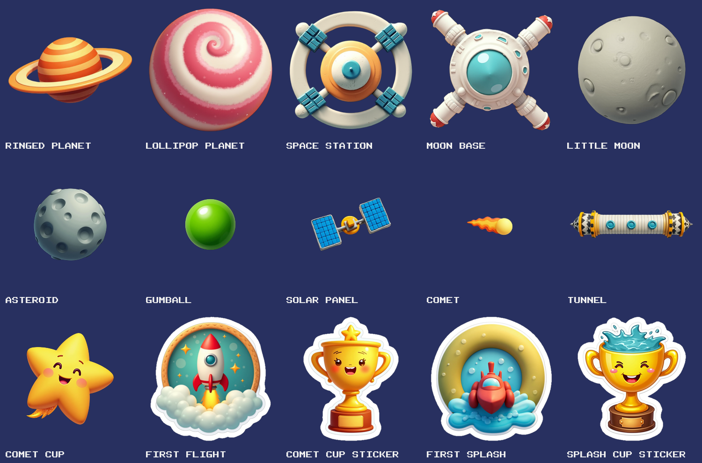
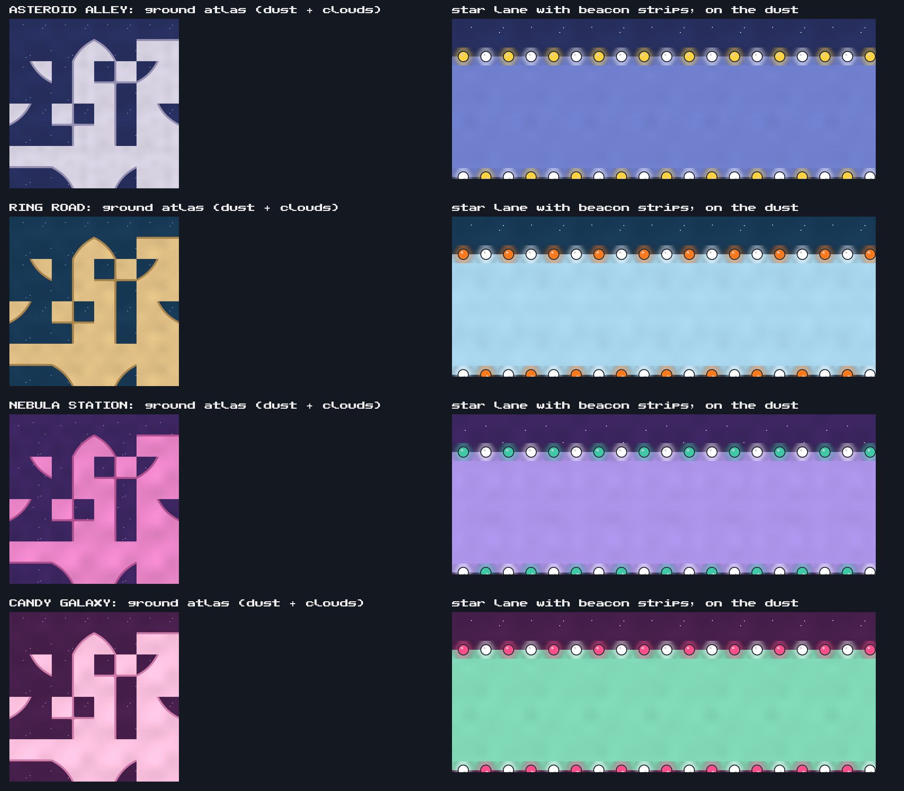

What making it taught:
- **Naming a real material still turns FLUX photographic.** "A cardboard box rocket" came out as
  a photo of cardboard; "a toy rocket made to look like a brown paper box, smooth matte clay toy"
  came out in the house style.
- **Animals and furniture come out side-on or tilted**, as the town's animals did. One whale seed
  in eight came out from above and the armchairs leaned diagonally; the user dropped both ships.
- **Facing has to be read off every pick.** The Star Freighter came out lying sideways (`left`)
  and the comet diagonally (`up_right`). The ringed planet is a three-quarter view and is never
  rotated.
- **A recolour of a white vehicle repaints all of it.** The green teacup lost its red seat and
  pink dots on every seed tried (11–15), because the white china is the "main body colour". It
  stays a plain green teacup.
- **Ring Road's music (seed 101) fails the loop-seam check** (2.22 against a limit of 1.0). It was
  kept because the user chose it by ear, having heard the jump back on the listening page.
  Seed 105 is the clean fallback.
- **A pilot laid over a ship looks stuck on top** (as the cars' sunroof did, §22). Baked in by
  Kontext, the pilot sits in the cockpit under the glass, lit like the ship. Kontext always draws
  the figure upright and looking out, head towards the top of the picture. The user wanted the
  head towards the tail, so the empty ship is turned 180° before the edit (`source_turn`) and
  the result faces down.
- **A figure on an open board never worked.** On the Star Surfer, Kontext laid the pilot flat,
  drew a front-view surfer on a side-view board, or a figure that looked out at the camera, even
  from a pose sketch drawn on the board. A seat or a cockpit is what makes a pilot read as
  sitting in a ship.
- **The user kept Vicky's seed 25**, a front view with his face, although it is not used in the
  game: `tools/comfy/masters/keep/`.

### 23.7 Under the hood (Gate C)

*Built 2026-10-08. Every space course raced headless with several ships, and the whole suite
passes.*

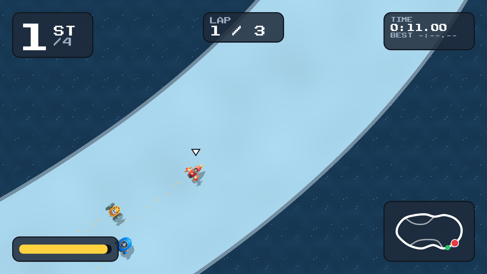
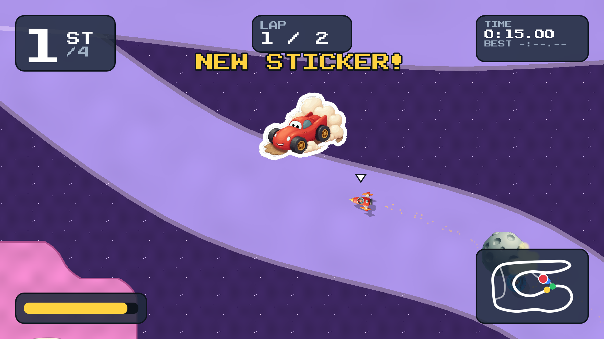

| Piece | What it is | File |
| --- | --- | --- |
| Ship | `class_name Ship extends Boat`: a boat's soft bounce and no skid marks, with a slow hover sway, a shadow far below, and `nudge()` for a comet. No currents, no ramps | [`actors/ship/ship.gd`](../actors/ship/ship.gd) |
| Ship scene | The boat's node layout, a capsule hull, the shadow always shown | [`actors/ship/ship.tscn`](../actors/ship/ship.tscn) |
| Exhaust and sound | A glow ribbon from the engine, stardust in a slide, sparkles on a bump or a nudge; the engine loop, a bonk, a twinkle | [`ship_effects.gd`](../actors/ship/ship_effects.gd), [`ship_audio.gd`](../actors/ship/ship_audio.gd) |
| Roster | Nine `DriftSetup`s with `kind = &"ship"`, on `base_ship.tres` | [`game/configs/ships/`](../game/configs/ships/) |
| Comet | The warning streak and chime, the fly-by, the nudge once a pass, a fixed rhythm per course | [`actors/space/comet.gd`](../actors/space/comet.gd) |
| Courses | Spec, points, scene, as for boat courses; the builder adds `Asteroids` (the drifting log's script with a rock), `Comets` and `Tunnels` (scenery bridges with the tunnel picture) | [`track/build/build_track.gd`](../track/build/build_track.gd) |
| Themes | `space = true`: the star lane and its glow, beacons for kerbs, the space surfaces in `Track.SURFACES` | [`game/configs/themes/`](../game/configs/themes/) |
| Three kinds | `GarageManager.KINDS`: roster, equipped, selected course per kind, one wallet; the title, join screen (V / X cycles CARS / BOATS / SPACE) and the garage's `LOOKS` (the Hangar) | [`garage_manager.gd`](../game/managers/garage_manager.gd) |
| Save | Schema 5: `equipped_ship`, `selected_space`; older saves come in with the Star Fighter | [`game/save_game.gd`](../game/save_game.gd) |
| Cup and stickers | The Comet Cup; First Flight and Comet Cup, and the boats' First Splash and Splash Cup (a Splash Cup won before is honoured) | [`cups/comet.tres`](../game/configs/cups/comet.tres), [`sticker_manager.gd`](../game/managers/sticker_manager.gd) |
| Ghosts | Developer ghosts for the four boat and four space courses (`record_ghosts.gd` now records every kind); a ghost finds its setup in any kind's folder | [`game/configs/ghosts/`](../game/configs/ghosts/) |
| Checks | A ship is a Ship, a Boat and a Car; it floats further than a boat; surfaces; an asteroid bump; a comet warns, nudges once and never spins, and comes again; branch progress; three kinds in the garage; a v4 save; paints; the cup and stickers. Full races: `race_test -- --autopilot --track=space_0N --setup=<ship>` | [`tests/space_test.gd`](../tests/space_test.gd) |

- **No driver layer on ships.** The pilots are in the pictures, so `DriverSeats` lists no ship.
  The space-helmet drivers (`art/drivers/space/`) are kept for later, at the user's wish.
- **The shelf** squeezes to fit: five cups on the shelf and eleven stickers in the book.

**Balance** (Asteroid Alley, normal difficulty; gap to the winner, or lead over 2nd):

| Ship | pace 1 | pace 0.85 | pace 0.7 |
| --- | --- | --- | --- |
| Star Fighter | 2nd +0.2s | 2nd +0.7s | 3rd +1.5s |
| Racing Pod | 1st +0.0s | 2nd +0.7s | 3rd +1.4s |
| Flying Saucer | 2nd +0.3s | 2nd +0.9s | 3rd +1.8s |
| Cardboard Rocket | 1st +0.0s | 2nd +0.9s | 3rd +1.7s |
| Space Taxi | 1st -0.2s | 2nd +0.7s | 3rd +1.5s |
| Star Glider | 1st -0.4s | 2nd +0.5s | 3rd +1.4s |
| Teacup Saucer | 2nd +0.4s | 3rd +1.2s | 3rd +2.3s |
| Star Freighter | 1st -0.3s | 2nd +0.5s | 3rd +1.3s |
| Comet Racer | 1st -0.7s | 2nd +0.3s | 3rd +1.3s |

The Comet Racer first won by 3.4 s; its power and top speed came down (×1.08, ×1.12) so the
top ship is the best, not a runaway.
